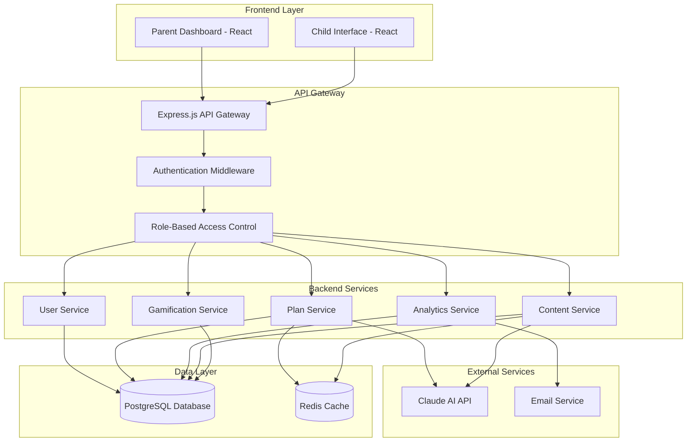

# Design Document

## Overview

The AI Study Planner is a full-stack web application built with a React frontend, Node.js backend, and PostgreSQL database. The system integrates with Claude AI via Anthropic's API to generate personalized study content and provide real-time assistance. The architecture supports two distinct user interfaces: a comprehensive parent dashboard and a gamified child interface, both sharing common backend services while maintaining role-based access control.

## Architecture

### High-Level Architecture



### Technology Stack

- **Frontend**: React 18 with TypeScript, Tailwind CSS, React Query for state management
- **Backend**: Node.js with Express.js, TypeScript
- **Database**: PostgreSQL with Prisma ORM
- **Cache**: Redis for session management and content caching
- **AI Integration**: Anthropic Claude API
- **Authentication**: JWT tokens with refresh token rotation, bcrypt for password hashing
- **Email Service**: SendGrid for email verification and notifications
- **Deployment**: Docker containers with Docker Compose for development

## Components and Interfaces

### Frontend Components

#### Parent Dashboard Components
- **PlanCreator**: Form interface for creating study plans with AI assistance
- **AnalyticsDashboard**: Real-time progress visualization with charts and metrics
- **ChildProfileManager**: Child account management and settings
- **PlanEditor**: Interface for reviewing and modifying AI-generated plans
- **ProgressAlerts**: Notification system for child engagement and performance

#### Child Interface Components
- **StudyDashboard**: Gamified home screen with progress visualization
- **ActivityPlayer**: Interactive study activity renderer
- **HelpAssistant**: Claude AI chat interface for children
- **AchievementCenter**: Badge and reward display system
- **ProgressTracker**: Visual progress bars and milestone celebrations

### Backend Service Interfaces

#### User Service
```typescript
interface UserService {
  // Parent account management
  registerParent(data: ParentRegistrationData): Promise<{ user: User, verificationToken: string }>
  verifyEmail(token: string): Promise<User>
  authenticateParent(credentials: LoginCredentials): Promise<AuthResult>
  resetPassword(email: string): Promise<void>
  updatePassword(userId: string, oldPassword: string, newPassword: string): Promise<void>
  
  // Child profile management
  createChildProfile(parentId: string, data: ChildProfileData): Promise<ChildProfile>
  updateChildProfile(parentId: string, childId: string, data: Partial<ChildProfileData>): Promise<ChildProfile>
  deleteChildProfile(parentId: string, childId: string): Promise<void>
  getChildrenByParent(parentId: string): Promise<ChildProfile[]>
  
  // Child authentication
  authenticateChild(username: string, pin: string): Promise<AuthResult>
  updateChildCredentials(parentId: string, childId: string, credentials: ChildCredentials): Promise<void>
  
  // Session management
  refreshToken(refreshToken: string): Promise<AuthResult>
  logout(userId: string): Promise<void>
  validateSession(token: string): Promise<User>
}
```

#### Plan Service
```typescript
interface PlanService {
  generateStudyPlan(params: PlanParameters): Promise<StudyPlan>
  updatePlan(planId: string, modifications: PlanModifications): Promise<StudyPlan>
  adaptPlan(planId: string, performanceData: PerformanceMetrics): Promise<StudyPlan>
  getActivePlans(childId: string): Promise<StudyPlan[]>
}
```

#### Content Service
```typescript
interface ContentService {
  generateActivity(planId: string, topic: string): Promise<StudyActivity>
  provideHelp(context: HelpContext, childAge: number): Promise<HelpResponse>
  validateContent(content: string, childAge: number): Promise<ContentValidation>
  cacheContent(key: string, content: any, ttl: number): Promise<void>
}
```

#### Analytics Service
```typescript
interface AnalyticsService {
  trackActivity(childId: string, activity: ActivityEvent): Promise<void>
  generateProgressReport(childId: string, timeframe: TimeFrame): Promise<ProgressReport>
  detectLearningPatterns(childId: string): Promise<LearningInsights>
  sendProgressAlerts(parentId: string, alerts: Alert[]): Promise<void>
}
```

## Data Models

### Authentication and User Management Models

```typescript
interface User {
  id: string
  email: string
  passwordHash: string
  role: 'parent' | 'child'
  isEmailVerified: boolean
  emailVerificationToken?: string
  passwordResetToken?: string
  passwordResetExpires?: Date
  createdAt: Date
  updatedAt: Date
}

interface ParentRegistrationData {
  email: string
  password: string
  firstName: string
  lastName: string
}

interface ChildProfileData {
  name: string
  age: number
  gradeLevel: string
  learningStyle: 'visual' | 'auditory' | 'kinesthetic' | 'mixed'
  username: string
  pin: string
  preferences: ChildPreferences
}

interface ChildProfile {
  id: string
  parentId: string
  name: string
  age: number
  gradeLevel: string
  learningStyle: 'visual' | 'auditory' | 'kinesthetic' | 'mixed'
  username: string
  pinHash: string
  preferences: ChildPreferences
  isActive: boolean
  createdAt: Date
  updatedAt: Date
}

interface LoginCredentials {
  email?: string
  username?: string
  password?: string
  pin?: string
}

interface AuthResult {
  user: User | ChildProfile
  accessToken: string
  refreshToken: string
  expiresIn: number
}

interface ChildCredentials {
  username: string
  pin: string
}

interface ChildPreferences {
  theme: 'light' | 'dark' | 'colorful'
  soundEnabled: boolean
  animationsEnabled: boolean
  difficultyPreference: 'easy' | 'medium' | 'hard' | 'adaptive'
}
```

### Core Entities

interface StudyPlan {
  id: string
  childId: string
  subject: string
  difficulty: string
  objectives: LearningObjective[]
  activities: StudyActivity[]
  status: 'draft' | 'active' | 'completed' | 'paused'
  createdAt: Date
  updatedAt: Date
}

interface StudyActivity {
  id: string
  planId: string
  title: string
  description: string
  content: ActivityContent
  estimatedDuration: number
  difficulty: number
  prerequisites: string[]
  completionCriteria: CompletionCriteria
}

interface ProgressRecord {
  id: string
  childId: string
  activityId: string
  status: 'not_started' | 'in_progress' | 'completed' | 'needs_help'
  score: number
  timeSpent: number
  helpRequests: HelpRequest[]
  completedAt?: Date
}

interface Achievement {
  id: string
  childId: string
  type: 'badge' | 'milestone' | 'streak'
  title: string
  description: string
  iconUrl: string
  earnedAt: Date
}
```

### Claude AI Integration Models

```typescript
interface ClaudeRequest {
  prompt: string
  maxTokens: number
  temperature: number
  childAge?: number
  contentType: 'study_plan' | 'activity' | 'help' | 'feedback'
}

interface ClaudeResponse {
  content: string
  usage: TokenUsage
  safety: SafetyCheck
  timestamp: Date
}

interface SafetyCheck {
  isAppropriate: boolean
  ageAppropriate: boolean
  educationalValue: number
  concerns: string[]
}
```

## Error Handling

### Error Categories

1. **Authentication Errors**: Invalid credentials, expired tokens, unauthorized access
2. **Validation Errors**: Invalid input data, missing required fields, constraint violations
3. **AI Service Errors**: Claude API failures, rate limiting, inappropriate content detection
4. **Database Errors**: Connection failures, constraint violations, transaction rollbacks
5. **Business Logic Errors**: Invalid state transitions, permission violations, resource conflicts

### Error Response Format

```typescript
interface ErrorResponse {
  error: {
    code: string
    message: string
    details?: any
    timestamp: Date
    requestId: string
  }
}
```

### Error Handling Strategy

- **Frontend**: Global error boundary with user-friendly error messages and retry mechanisms
- **Backend**: Centralized error middleware with structured logging and error categorization
- **AI Integration**: Fallback content generation and graceful degradation when Claude API is unavailable
- **Database**: Transaction rollback and connection pool management with automatic retry logic

## Testing Strategy

### Unit Testing
- **Frontend**: Jest and React Testing Library for component testing
- **Backend**: Jest for service layer testing with mocked dependencies
- **Database**: In-memory PostgreSQL for isolated data layer testing
- **AI Integration**: Mocked Claude API responses for predictable testing

### Integration Testing
- **API Testing**: Supertest for endpoint testing with test database
- **Database Integration**: Prisma migrations and seed data for consistent test environments
- **External Service Integration**: Contract testing for Claude API integration

### End-to-End Testing
- **User Flows**: Playwright for critical user journeys (plan creation, child study sessions)
- **Cross-Browser Testing**: Automated testing across Chrome, Firefox, and Safari
- **Mobile Responsiveness**: Testing on various device sizes and orientations

### Performance Testing
- **Load Testing**: Artillery.js for API endpoint load testing
- **Database Performance**: Query optimization and index effectiveness testing
- **AI Response Times**: Monitoring Claude API response times and implementing timeouts

### Security Testing
- **Authentication**: JWT token validation and refresh token rotation testing
- **Authorization**: Role-based access control verification
- **Input Validation**: SQL injection and XSS prevention testing
- **Content Safety**: AI-generated content appropriateness validation

### Monitoring and Observability
- **Application Monitoring**: Winston logging with structured log format
- **Performance Monitoring**: Response time tracking and database query performance
- **AI Usage Monitoring**: Claude API usage tracking and cost optimization
- **User Analytics**: Privacy-compliant usage analytics for feature optimization