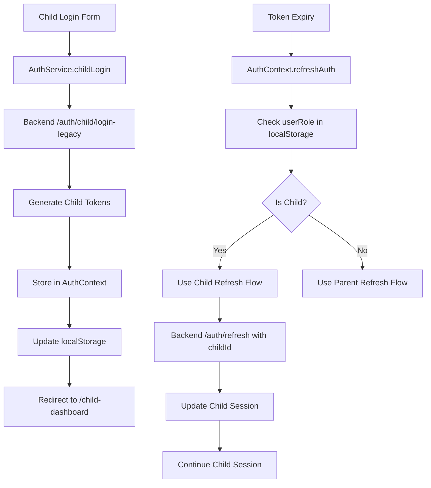

# Child Authentication Fix Design

## Overview

This design addresses the critical child authentication issues in the AI Study Planner application. The main problem is that children can log in successfully but are immediately logged out and redirected to the parent login page due to inconsistencies in authentication state management, token refresh mechanisms, and routing logic.

## Architecture

### Current Authentication Flow Issues

1. **AuthContext Inconsistency**: The `refreshAuth` method has different logic paths for child vs parent users, causing session restoration failures
2. **Token Refresh Mismatch**: Child tokens are stored with `childId` but the refresh mechanism expects `userId`
3. **Role Detection Problems**: The `isChild` detection relies on user role but child users may have inconsistent role values
4. **Routing Logic Errors**: Protected routes don't properly handle child user redirection
5. **Session Storage Conflicts**: Child session data is stored inconsistently across localStorage keys

### Proposed Authentication Architecture



## Components and Interfaces

### 1. AuthContext Redesign

**Current Issues:**
- Inconsistent child user detection
- Different refresh logic paths causing failures
- Role-based routing not working properly

**Design Solution:**
```typescript
interface AuthContextType {
  user: User | null;
  isLoading: boolean;
  isAuthenticated: boolean;
  isChild: boolean;
  userRole: 'parent' | 'child' | null; // Explicit role tracking
  login: (credentials: LoginCredentials) => Promise<void>;
  childLogin: (username: string, pin: string) => Promise<void>;
  register: (data: RegisterData) => Promise<void>;
  logout: () => Promise<void>;
  refreshAuth: () => Promise<void>;
}

// Enhanced user type to handle both parent and child users
interface User {
  id: string;
  role: 'PARENT' | 'CHILD';
  // Parent-specific fields
  email?: string;
  firstName?: string;
  lastName?: string;
  // Child-specific fields
  username?: string;
  name?: string;
  parentId?: string;
}
```

**Key Changes:**
1. **Explicit Role Tracking**: Add `userRole` field to track 'parent' | 'child' | null
2. **Unified User Interface**: Support both parent and child user data in single interface
3. **Consistent Storage Keys**: Use standardized localStorage keys for all user types
4. **Improved Child Detection**: Use multiple indicators (role, userRole, username presence)

### 2. Token Refresh Mechanism

**Current Issues:**
- Backend `refreshToken` method doesn't handle child tokens properly
- Frontend refresh logic doesn't account for child-specific token format
- Refresh failures cause immediate logout instead of graceful handling

**Design Solution:**
```typescript
// Backend: Enhanced refresh token handling
async refreshToken(refreshToken: string): Promise<AuthResult> {
  const tokenRecord = await prisma.refreshToken.findUnique({
    where: { token: refreshToken },
    include: { 
      user: true,
      child: {
        include: {
          parent: true
        }
      }
    }
  });

  // Handle child token refresh
  if (tokenRecord?.childId && tokenRecord.child) {
    return this.refreshChildToken(refreshToken);
  }
  
  // Handle parent token refresh
  if (tokenRecord?.userId && tokenRecord.user) {
    return this.refreshParentToken(refreshToken);
  }
  
  throw new Error('Invalid refresh token');
}

// Frontend: Unified refresh handling
const refreshAuth = async () => {
  const refreshToken = localStorage.getItem('refreshToken');
  const userRole = localStorage.getItem('userRole');
  
  if (!refreshToken) {
    setIsLoading(false);
    return;
  }

  try {
    const result = await authApi.refreshToken(refreshToken);
    
    // Update tokens and user data
    localStorage.setItem('accessToken', result.accessToken);
    localStorage.setItem('refreshToken', result.refreshToken);
    localStorage.setItem('user', JSON.stringify(result.user));
    localStorage.setItem('userRole', result.user.role === 'CHILD' ? 'child' : 'parent');
    
    setUser(result.user);
  } catch (error) {
    // Clear all auth data on refresh failure
    clearAuthData();
    
    // Redirect based on previous user role
    if (userRole === 'child') {
      window.location.href = '/child-login';
    } else {
      window.location.href = '/login';
    }
  } finally {
    setIsLoading(false);
  }
};
```

### 3. Routing and Navigation

**Current Issues:**
- ProtectedRoute doesn't properly handle child users
- Child users get redirected to parent routes
- Authentication failures redirect to wrong login page

**Design Solution:**
```typescript
// Enhanced ProtectedRoute component
const ProtectedRoute: React.FC<{ children: React.ReactNode }> = ({ children }) => {
  const { isAuthenticated, isLoading, user } = useAuth();
  const location = useLocation();

  if (isLoading) {
    return <LoadingSpinner />;
  }

  if (!isAuthenticated) {
    // Redirect to appropriate login based on current path
    const isChildPath = location.pathname.startsWith('/child') || 
                       location.pathname === '/child-dashboard';
    return <Navigate to={isChildPath ? "/child-login" : "/login"} replace />;
  }

  // Handle role-based routing
  if (user?.role === 'CHILD') {
    // Child users can only access child routes
    const allowedChildPaths = ['/child-dashboard', '/child/', '/child-login'];
    const isAllowedPath = allowedChildPaths.some(path => 
      location.pathname === path || location.pathname.startsWith(path)
    );
    
    if (!isAllowedPath) {
      return <Navigate to="/child-dashboard" replace />;
    }
  } else if (user?.role === 'PARENT') {
    // Parent users cannot access child-specific routes
    if (location.pathname.startsWith('/child/') || location.pathname === '/child-dashboard') {
      return <Navigate to="/dashboard" replace />;
    }
  }

  return <>{children}</>;
};

// Enhanced PublicRoute component
const PublicRoute: React.FC<{ children: React.ReactNode }> = ({ children }) => {
  const { isAuthenticated, isLoading, user } = useAuth();

  if (isLoading) {
    return <LoadingSpinner />;
  }

  if (isAuthenticated) {
    // Redirect to appropriate dashboard based on user role
    const redirectPath = user?.role === 'CHILD' ? '/child-dashboard' : '/dashboard';
    return <Navigate to={redirectPath} replace />;
  }

  return <>{children}</>;
};
```

### 4. Session Management

**Current Issues:**
- Child session data stored inconsistently
- Session validation doesn't account for child-specific requirements
- Session cleanup doesn't handle child sessions properly

**Design Solution:**
```typescript
// Standardized session storage
interface SessionData {
  user: User;
  userRole: 'parent' | 'child';
  accessToken: string;
  refreshToken: string;
  loginTime: string;
  sessionId?: string; // For child sessions
}

// Session management utilities
class SessionManager {
  static saveSession(sessionData: SessionData): void {
    localStorage.setItem('accessToken', sessionData.accessToken);
    localStorage.setItem('refreshToken', sessionData.refreshToken);
    localStorage.setItem('user', JSON.stringify(sessionData.user));
    localStorage.setItem('userRole', sessionData.userRole);
    localStorage.setItem('loginTime', sessionData.loginTime);
    
    if (sessionData.sessionId) {
      localStorage.setItem('sessionId', sessionData.sessionId);
    }
  }

  static loadSession(): SessionData | null {
    try {
      const accessToken = localStorage.getItem('accessToken');
      const refreshToken = localStorage.getItem('refreshToken');
      const userStr = localStorage.getItem('user');
      const userRole = localStorage.getItem('userRole') as 'parent' | 'child';
      const loginTime = localStorage.getItem('loginTime');
      const sessionId = localStorage.getItem('sessionId');

      if (!accessToken || !refreshToken || !userStr || !userRole) {
        return null;
      }

      return {
        user: JSON.parse(userStr),
        userRole,
        accessToken,
        refreshToken,
        loginTime: loginTime || new Date().toISOString(),
        sessionId: sessionId || undefined
      };
    } catch (error) {
      console.error('Failed to load session:', error);
      return null;
    }
  }

  static clearSession(): void {
    const keysToRemove = [
      'accessToken', 'refreshToken', 'user', 'userRole', 
      'loginTime', 'sessionId'
    ];
    
    keysToRemove.forEach(key => localStorage.removeItem(key));
  }

  static isChildSession(): boolean {
    return localStorage.getItem('userRole') === 'child';
  }
}
```

## Data Models

### Enhanced User Model
```typescript
interface User {
  id: string;
  role: 'PARENT' | 'CHILD';
  
  // Parent fields
  email?: string;
  firstName?: string;
  lastName?: string;
  isEmailVerified?: boolean;
  
  // Child fields
  username?: string;
  name?: string;
  parentId?: string;
  age?: number;
  grade?: string;
  
  // Common fields
  createdAt?: string;
  updatedAt?: string;
}
```

### Authentication Result Model
```typescript
interface AuthResult {
  user: User;
  accessToken: string;
  refreshToken: string;
  expiresIn?: number;
  sessionId?: string; // For child sessions
}
```

## Error Handling

### Authentication Error Categories
1. **Network Errors**: Connection issues, timeouts
2. **Validation Errors**: Invalid credentials, malformed requests
3. **Session Errors**: Expired tokens, invalid sessions
4. **Authorization Errors**: Insufficient permissions, role mismatches
5. **System Errors**: Database issues, service unavailability

### Error Handling Strategy
```typescript
interface AuthError {
  code: string;
  message: string;
  userFriendlyMessage: string;
  recoveryActions: string[];
  shouldRedirect: boolean;
  redirectPath?: string;
}

// Child-friendly error messages
const CHILD_ERROR_MESSAGES = {
  INVALID_CREDENTIALS: {
    code: 'INVALID_CREDENTIALS',
    message: 'Invalid username or PIN',
    userFriendlyMessage: 'Oops! Your username or PIN doesn\'t match. Let\'s try again! 🔑',
    recoveryActions: ['Try again', 'Ask for help'],
    shouldRedirect: false
  },
  SESSION_EXPIRED: {
    code: 'SESSION_EXPIRED',
    message: 'Session has expired',
    userFriendlyMessage: 'Your learning time is up! Please log in again to continue. ⏰',
    recoveryActions: ['Log in again'],
    shouldRedirect: true,
    redirectPath: '/child-login'
  },
  NETWORK_ERROR: {
    code: 'NETWORK_ERROR',
    message: 'Network connection failed',
    userFriendlyMessage: 'We\'re having trouble connecting. Check your internet and try again! 🌐',
    recoveryActions: ['Try again', 'Check connection'],
    shouldRedirect: false
  }
};
```

## Testing Strategy

### Unit Tests
1. **AuthContext Tests**: Test all authentication state transitions
2. **Token Refresh Tests**: Test both parent and child token refresh flows
3. **Session Management Tests**: Test session storage and retrieval
4. **Routing Tests**: Test protected and public route behavior
5. **Error Handling Tests**: Test all error scenarios and recovery

### Integration Tests
1. **Child Login Flow**: End-to-end child authentication
2. **Session Persistence**: Test session survival across page refreshes
3. **Token Refresh Integration**: Test automatic token refresh
4. **Role-based Navigation**: Test routing for different user roles
5. **Logout Flow**: Test complete session cleanup

### Test Scenarios
```typescript
describe('Child Authentication Flow', () => {
  test('Child can log in and access dashboard', async () => {
    // 1. Child enters credentials
    // 2. System authenticates child
    // 3. Child is redirected to dashboard
    // 4. Dashboard loads successfully
  });

  test('Child session persists across page refresh', async () => {
    // 1. Child logs in
    // 2. Page is refreshed
    // 3. Child remains authenticated
    // 4. Dashboard is accessible
  });

  test('Child tokens are refreshed automatically', async () => {
    // 1. Child is logged in with expired token
    // 2. System attempts API call
    // 3. Token is refreshed automatically
    // 4. API call succeeds
  });

  test('Child is redirected to child login on auth failure', async () => {
    // 1. Child session becomes invalid
    // 2. System detects auth failure
    // 3. Child is redirected to /child-login
    // 4. Appropriate error message is shown
  });
});
```

## Security Considerations

### Child Session Security
1. **Session Duration**: Shorter session timeouts for child users (20 minutes)
2. **Activity Monitoring**: Track child activity for parental oversight
3. **Device Binding**: Associate sessions with device information
4. **Suspicious Activity Detection**: Monitor for unusual login patterns
5. **Parental Notifications**: Alert parents of child login/logout events

### Token Security
1. **Secure Storage**: Use httpOnly cookies where possible
2. **Token Rotation**: Regular refresh token rotation
3. **Scope Limitation**: Child tokens have limited API access
4. **Expiration Handling**: Graceful handling of expired tokens
5. **Revocation Support**: Ability to revoke child sessions remotely

## Performance Considerations

### Optimization Strategies
1. **Lazy Loading**: Load child-specific components only when needed
2. **Session Caching**: Cache session validation results
3. **Token Prefetch**: Proactively refresh tokens before expiration
4. **Route Preloading**: Preload child dashboard components
5. **Error Recovery**: Fast recovery from authentication failures

### Monitoring and Metrics
1. **Authentication Success Rate**: Track login success/failure rates
2. **Session Duration**: Monitor average child session lengths
3. **Token Refresh Rate**: Track automatic refresh frequency
4. **Error Frequency**: Monitor authentication error patterns
5. **Performance Metrics**: Track authentication response times

## Implementation Priority

### Phase 1: Core Authentication Fix (High Priority)
1. Fix AuthContext refresh logic for child users
2. Implement proper token refresh mechanism
3. Fix routing logic for child users
4. Add consistent session storage

### Phase 2: Enhanced Error Handling (Medium Priority)
1. Implement child-friendly error messages
2. Add proper error recovery mechanisms
3. Improve network error handling
4. Add authentication retry logic

### Phase 3: Security and Monitoring (Medium Priority)
1. Enhance session security for child users
2. Add comprehensive authentication logging
3. Implement suspicious activity detection
4. Add parental notification system

### Phase 4: Performance and UX (Low Priority)
1. Optimize authentication performance
2. Add loading states and transitions
3. Implement session persistence improvements
4. Add advanced session management features