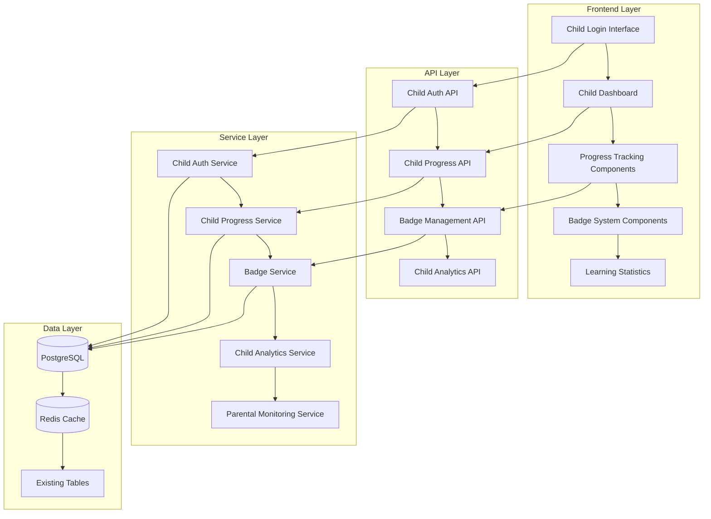

# Design Document

## Overview

The Child Progress Module provides children with an independent, gamified learning interface that integrates seamlessly with the existing AI Study Planner architecture. This module enhances the current child dashboard and authentication system while adding comprehensive progress tracking and badge functionality. The design builds upon existing components and services to create a cohesive child-focused experience with enhanced safety and parental oversight.

## Architecture

### High-Level Architecture



### Database Schema Extensions

The existing schema will be extended with the following enhancements to support child progress tracking:

```sql
-- Enhanced progress tracking for activities
ALTER TABLE progress_records ADD COLUMN session_data JSONB DEFAULT '{}';
ALTER TABLE progress_records ADD COLUMN help_requests_count INTEGER DEFAULT 0;
ALTER TABLE progress_records ADD COLUMN pause_count INTEGER DEFAULT 0;
ALTER TABLE progress_records ADD COLUMN resume_count INTEGER DEFAULT 0;

-- Child login activity tracking
CREATE TABLE child_login_sessions (
  id VARCHAR PRIMARY KEY DEFAULT gen_random_uuid(),
  child_id VARCHAR NOT NULL REFERENCES child_profiles(id) ON DELETE CASCADE,
  login_time TIMESTAMP DEFAULT NOW(),
  logout_time TIMESTAMP,
  device_info JSONB DEFAULT '{}',
  ip_address INET,
  session_duration INTEGER, -- in seconds
  activities_completed INTEGER DEFAULT 0,
  badges_earned INTEGER DEFAULT 0,
  created_at TIMESTAMP DEFAULT NOW()
);

-- Enhanced achievement tracking
ALTER TABLE achievements ADD COLUMN celebration_shown BOOLEAN DEFAULT false;
ALTER TABLE achievements ADD COLUMN parent_notified BOOLEAN DEFAULT false;
ALTER TABLE achievements ADD COLUMN earned_in_session VARCHAR;

-- Learning streaks tracking
CREATE TABLE learning_streaks (
  id VARCHAR PRIMARY KEY DEFAULT gen_random_uuid(),
  child_id VARCHAR NOT NULL REFERENCES child_profiles(id) ON DELETE CASCADE,
  streak_type VARCHAR NOT NULL, -- 'daily', 'weekly', 'activity_completion'
  current_count INTEGER DEFAULT 0,
  longest_count INTEGER DEFAULT 0,
  last_activity_date DATE,
  streak_start_date DATE,
  is_active BOOLEAN DEFAULT true,
  created_at TIMESTAMP DEFAULT NOW(),
  updated_at TIMESTAMP DEFAULT NOW(),
  UNIQUE(child_id, streak_type)
);
```

## Components and Interfaces

### Frontend Components

#### 1. Enhanced Child Authentication
- **Location**: `frontend/src/components/auth/`
- **Components**:
  - `ChildLoginForm.tsx` - Enhanced version with improved UX and security logging
  - `ChildAuthGuard.tsx` - Route protection for child-specific routes
  - `ChildSessionManager.tsx` - Session timeout and activity monitoring

#### 2. Child Dashboard Enhancement
- **Location**: `frontend/src/components/child/`
- **Components**:
  - `ChildDashboard.tsx` - Enhanced with real-time progress tracking
  - `StudyPlanProgressCard.tsx` - Visual study plan progress display
  - `DailyGoalsWidget.tsx` - Daily learning objectives and progress
  - `QuickStatsPanel.tsx` - At-a-glance learning statistics

#### 3. Progress Tracking System
- **Location**: `frontend/src/components/progress/`
- **Components**:
  - `ActivityProgressTracker.tsx` - Real-time activity progress updates
  - `ProgressVisualization.tsx` - Child-friendly progress charts using Recharts
  - `CompletionCelebration.tsx` - Activity completion animations
  - `ProgressHistory.tsx` - Historical progress view

#### 4. Badge and Achievement System
- **Location**: `frontend/src/components/badges/`
- **Components**:
  - `BadgeDisplay.tsx` - Individual badge component with animations
  - `BadgeCollection.tsx` - Grid layout for earned badges
  - `BadgeEarnedModal.tsx` - Celebration modal with confetti animation
  - `BadgeProgress.tsx` - Progress toward next badge
  - `AchievementCenter.tsx` - Comprehensive achievement overview

#### 5. Learning Analytics for Children
- **Location**: `frontend/src/components/childAnalytics/`
- **Components**:
  - `LearningStreakDisplay.tsx` - Streak visualization with fire animations
  - `WeeklyProgressChart.tsx` - Child-friendly weekly summary
  - `SubjectMasteryRadar.tsx` - Radar chart for subject proficiency
  - `LearningTimeTracker.tsx` - Time spent learning visualization

### Backend Services

#### 1. Enhanced Child Authentication Service
- **Location**: `backend/src/services/childAuthService.ts`
- **Responsibilities**:
  - Child-specific authentication with PIN validation
  - Session management with automatic timeout
  - Login activity tracking and parental notifications
  - Security monitoring for suspicious activity

#### 2. Child Progress Tracking Service
- **Location**: `backend/src/services/childProgressService.ts`
- **Responsibilities**:
  - Real-time progress updates and persistence
  - Activity completion validation and scoring
  - Progress history aggregation and analysis
  - Learning streak calculation and maintenance

#### 3. Child Badge Management Service
- **Location**: `backend/src/services/childBadgeService.ts`
- **Responsibilities**:
  - Badge eligibility checking and automatic awarding
  - Achievement progress tracking
  - Celebration trigger management
  - Badge category and rarity management

#### 4. Child Analytics Service
- **Location**: `backend/src/services/childAnalyticsService.ts`
- **Responsibilities**:
  - Child-specific analytics data aggregation
  - Learning pattern analysis and insights
  - Performance trend calculation
  - Parental report generation

### API Endpoints

#### Enhanced Child Authentication
```typescript
POST /api/child/auth/login          // Child login with username/PIN
POST /api/child/auth/logout         // Secure logout with session cleanup
POST /api/child/auth/refresh        // Token refresh for extended sessions
GET  /api/child/auth/session        // Current session information
```

#### Child Progress Management
```typescript
GET  /api/child/:childId/dashboard  // Dashboard data with progress summary
GET  /api/child/:childId/progress   // Detailed progress information
POST /api/child/activity/:activityId/progress  // Update activity progress
POST /api/child/activity/:activityId/complete  // Mark activity complete
GET  /api/child/:childId/streaks    // Learning streak information
```

#### Badge and Achievement System
```typescript
GET  /api/child/:childId/badges     // All earned badges
GET  /api/child/:childId/badges/progress  // Progress toward next badges
POST /api/child/:childId/badges/celebrate  // Mark celebration as shown
GET  /api/child/:childId/achievements      // Achievement history
```

## Data Models

### Enhanced Child Profile Model
```typescript
interface EnhancedChildProfile extends ChildProfile {
  loginSessions: ChildLoginSession[];
  progressSummary: ChildProgressSummary;
  learningStreaks: LearningStreak[];
  currentSession?: ChildLoginSession;
}

interface ChildLoginSession {
  id: string;
  childId: string;
  loginTime: Date;
  logoutTime?: Date;
  deviceInfo: DeviceInfo;
  ipAddress: string;
  sessionDuration?: number; // in seconds
  activitiesCompleted: number;
  badgesEarned: number;
  isActive: boolean;
}

interface DeviceInfo {
  userAgent: string;
  platform: string;
  isMobile: boolean;
  screenResolution?: string;
}
```

### Progress Tracking Models
```typescript
interface EnhancedActivityProgress extends ProgressRecord {
  sessionData: ActivitySessionData;
  helpRequestsCount: number;
  pauseCount: number;
  resumeCount: number;
  interactionEvents: InteractionEvent[];
}

interface ActivitySessionData {
  startTime: Date;
  endTime?: Date;
  pausedDuration: number; // total time paused in seconds
  focusEvents: FocusEvent[];
  difficultyAdjustments: DifficultyAdjustment[];
  helpRequests: HelpRequest[];
}

interface ChildProgressSummary {
  totalActivities: number;
  completedActivities: number;
  inProgressActivities: number;
  totalTimeSpent: number; // in seconds
  averageScore: number;
  currentDailyStreak: number;
  longestDailyStreak: number;
  lastActivityDate: Date | null;
  weeklyGoalProgress: number; // percentage
  monthlyGoalProgress: number; // percentage
  subjectProgress: SubjectProgressSummary[];
}

interface SubjectProgressSummary {
  subjectId: string;
  subjectName: string;
  completedActivities: number;
  totalActivities: number;
  averageScore: number;
  timeSpent: number;
  proficiencyLevel: ProficiencyLevel;
  lastActivity: Date | null;
}
```

### Learning Streak Models
```typescript
interface LearningStreak {
  id: string;
  childId: string;
  streakType: StreakType;
  currentCount: number;
  longestCount: number;
  lastActivityDate: Date | null;
  streakStartDate: Date | null;
  isActive: boolean;
  milestones: StreakMilestone[];
}

type StreakType = 'daily' | 'weekly' | 'activity_completion' | 'perfect_score' | 'help_free';

interface StreakMilestone {
  count: number;
  achievedAt: Date;
  badgeAwarded?: string;
}
```

### Enhanced Badge System Models
```typescript
interface EnhancedAchievement extends Achievement {
  celebrationShown: boolean;
  parentNotified: boolean;
  earnedInSession?: string;
  progressToNext?: BadgeProgress;
  celebrationConfig: CelebrationConfig;
}

interface BadgeProgress {
  badgeId: string;
  currentValue: number;
  targetValue: number;
  progressPercentage: number;
  estimatedTimeToCompletion?: string;
}

interface CelebrationConfig {
  animationType: 'confetti' | 'fireworks' | 'stars' | 'bounce';
  duration: number; // in milliseconds
  soundEffect?: string;
  message: string;
  icon: string;
}
```

## Error Handling

### Child-Friendly Error System
Following the existing error handling patterns while making them child-appropriate:

```typescript
interface ChildErrorHandler {
  formatErrorForChild(error: Error, childAge: number): ChildFriendlyError;
  logChildError(childId: string, error: Error, context: ErrorContext): void;
  notifyParentOfError(childId: string, error: Error): void;
  showRecoveryOptions(error: Error): RecoveryOption[];
}

interface ChildFriendlyError {
  title: string;
  message: string;
  icon: string;
  severity: 'info' | 'warning' | 'error';
  actionButton?: {
    text: string;
    action: () => void;
  };
  parentNotification: boolean;
}
```

### Error Categories and Messages
- **Authentication Errors**: "Oops! Let's try logging in again 🔑"
- **Network Errors**: "Hmm, let's check your internet connection 🌐"
- **Activity Errors**: "This activity needs a little break. Try another one! 🎯"
- **Progress Errors**: "We're having trouble saving your progress. Don't worry, we'll try again! 💾"
- **Badge Errors**: "Something went wrong with your badges. They'll appear soon! 🏅"
- **Session Timeout**: "Time for a break! Please log in again to continue learning 🕐"

## Testing Strategy

### Unit Testing
Following the existing testing patterns with child-specific enhancements:
- **Component Testing**: React Testing Library for all child components with age-appropriate interaction testing
- **Service Testing**: Jest for all backend services with mock child data
- **API Testing**: Supertest for child-specific endpoints with authentication testing
- **Badge System Testing**: Comprehensive testing of badge eligibility and awarding logic

### Integration Testing
- **End-to-End Testing**: Cypress tests for complete child user journeys
  - Child login flow with PIN validation
  - Activity completion and progress tracking
  - Badge earning and celebration flows
  - Session timeout and re-authentication
- **Parent-Child Integration**: Test parental monitoring and notification systems
- **Real-time Updates**: Test progress synchronization across sessions

### Accessibility Testing
Extending existing accessibility testing for child-specific needs:
- **Screen Reader Testing**: Child-friendly announcements and descriptions
- **Keyboard Navigation**: Large touch targets and simple navigation patterns
- **Color Contrast**: High contrast for child theme with WCAG AAA compliance
- **Font Size**: Scalable fonts appropriate for different age groups
- **Motor Skills**: Testing for children with developing fine motor skills

### Child-Specific Testing
- **Age-Appropriate Testing**: Different test scenarios for age groups (5-8, 9-12, 13-18)
- **Attention Span Testing**: Validate session length recommendations
- **Safety Testing**: Comprehensive testing of all safety and parental control features
- **Gamification Testing**: Badge earning logic and celebration timing

## Security Considerations

### Child Data Protection
Following existing security patterns with enhanced child-specific protections:
- **COPPA Compliance**: Ensure compliance with Children's Online Privacy Protection Act
- **Data Minimization**: Collect only necessary data for educational purposes
- **Parental Consent**: Leverage existing parental consent mechanisms
- **Data Retention**: Follow established data retention policies with child-specific considerations

### Authentication Security
Extending the existing authentication system:
- **PIN Security**: Secure PIN hashing using existing bcrypt implementation
- **Session Management**: Shorter session timeouts for child accounts (20 minutes vs 2 hours)
- **Device Tracking**: Integration with existing security logging system
- **Suspicious Activity**: Enhanced monitoring for child accounts with parent notifications

### Content Safety
Building on existing content safety infrastructure:
- **Content Filtering**: Integration with existing content safety service
- **Interaction Monitoring**: Enhanced logging for child interactions
- **Emergency Protocols**: Integration with existing parental notification system
- **Parental Oversight**: Enhanced reporting through existing analytics system

## Performance Optimization

### Caching Strategy
Extending existing Redis caching:
- **Child Progress Data**: Cache frequently accessed progress summaries (15-minute TTL)
- **Badge Information**: Cache badge eligibility and progress data (5-minute TTL)
- **Session Data**: Cache active child sessions for quick validation
- **Analytics Data**: Cache child-specific analytics for dashboard performance

### Database Optimization
Building on existing database optimization:
- **Indexed Queries**: Add indexes for child progress and badge queries
- **Connection Pooling**: Utilize existing Prisma connection pooling
- **Query Optimization**: Optimize complex badge eligibility queries
- **Batch Operations**: Batch badge awards and progress updates

### Frontend Optimization
Following existing frontend optimization patterns:
- **Lazy Loading**: Implement for badge collection and progress history components
- **Image Optimization**: Optimize badge icons and celebration animations
- **Animation Performance**: Use CSS transforms and GPU acceleration
- **Bundle Splitting**: Separate child-specific code using existing code splitting patterns

### Mobile Optimization
Enhancing existing responsive design:
- **Touch Interactions**: Large touch targets (minimum 44px) for child-friendly interaction
- **Responsive Design**: Enhanced breakpoints for tablet usage in educational settings
- **Offline Support**: Cache essential progress data for offline completion tracking
- **Battery Optimization**: Efficient animation and reduced background processing