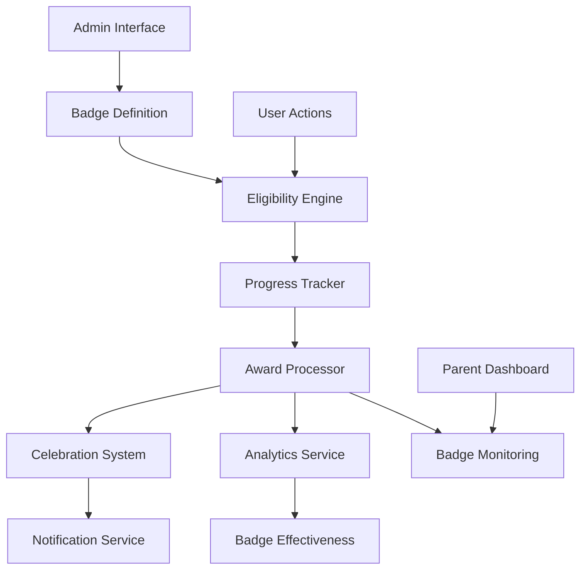

# Badge System Configuration and Customization Guide

## Table of Contents
1. [Overview](#overview)
2. [Badge System Architecture](#badge-system-architecture)
3. [Badge Configuration](#badge-configuration)
4. [Badge Categories and Types](#badge-categories-and-types)
5. [Eligibility Rules Engine](#eligibility-rules-engine)
6. [Celebration System](#celebration-system)
7. [Customization Options](#customization-options)
8. [Administration Interface](#administration-interface)
9. [Performance Optimization](#performance-optimization)
10. [Troubleshooting](#troubleshooting)

## Overview

The Badge System is a comprehensive gamification engine designed to motivate children through achievement recognition and progress visualization. This document provides detailed configuration and customization instructions for administrators, developers, and educational coordinators.

### Key Features
- **Dynamic Badge Creation**: Create badges with flexible eligibility criteria
- **Real-time Eligibility Checking**: Automatic badge awarding based on user actions
- **Celebration Engine**: Customizable celebration animations and notifications
- **Progress Tracking**: Visual progress indicators toward badge achievements
- **Rarity System**: Multiple badge tiers to maintain long-term engagement
- **Analytics Integration**: Badge earning patterns and effectiveness metrics

## Badge System Architecture

### Core Components



### Database Schema

#### Badge Definitions Table
```sql
CREATE TABLE badge_definitions (
  id VARCHAR PRIMARY KEY,
  name VARCHAR NOT NULL,
  description TEXT,
  category VARCHAR NOT NULL,
  rarity VARCHAR NOT NULL,
  icon_url VARCHAR,
  eligibility_rules JSONB NOT NULL,
  celebration_config JSONB,
  is_active BOOLEAN DEFAULT true,
  created_at TIMESTAMP DEFAULT NOW(),
  updated_at TIMESTAMP DEFAULT NOW()
);
```

#### Badge Progress Table
```sql
CREATE TABLE badge_progress (
  id VARCHAR PRIMARY KEY,
  child_id VARCHAR NOT NULL,
  badge_id VARCHAR NOT NULL,
  current_value NUMERIC DEFAULT 0,
  target_value NUMERIC NOT NULL,
  progress_percentage NUMERIC DEFAULT 0,
  last_updated TIMESTAMP DEFAULT NOW(),
  UNIQUE(child_id, badge_id)
);
```

#### Badge Awards Table (extends existing achievements)
```sql
ALTER TABLE achievements ADD COLUMN badge_definition_id VARCHAR;
ALTER TABLE achievements ADD COLUMN celebration_shown BOOLEAN DEFAULT false;
ALTER TABLE achievements ADD COLUMN parent_notified BOOLEAN DEFAULT false;
ALTER TABLE achievements ADD COLUMN earned_in_session VARCHAR;
```

## Badge Configuration

### Basic Badge Definition

```json
{
  "id": "first_activity_complete",
  "name": "Getting Started",
  "description": "Complete your first learning activity",
  "category": "milestone",
  "rarity": "common",
  "icon": "🎯",
  "eligibility_rules": {
    "type": "activity_completion",
    "conditions": {
      "activities_completed": {
        "operator": ">=",
        "value": 1
      }
    }
  },
  "celebration_config": {
    "animation": "confetti",
    "duration": 3000,
    "sound": "success_chime",
    "message": "Congratulations! You completed your first activity!"
  }
}
```

### Advanced Badge Configuration

```json
{
  "id": "math_master_week",
  "name": "Math Master",
  "description": "Complete 10 math activities with 90%+ average score in one week",
  "category": "subject_mastery",
  "rarity": "rare",
  "icon": "🧮",
  "eligibility_rules": {
    "type": "composite",
    "timeframe": "week",
    "conditions": {
      "and": [
        {
          "activities_completed": {
            "operator": ">=",
            "value": 10,
            "filter": {
              "subject": "mathematics"
            }
          }
        },
        {
          "average_score": {
            "operator": ">=",
            "value": 90,
            "filter": {
              "subject": "mathematics"
            }
          }
        }
      ]
    }
  },
  "celebration_config": {
    "animation": "fireworks",
    "duration": 5000,
    "sound": "achievement_fanfare",
    "message": "Amazing! You're a Math Master this week!",
    "special_effects": ["screen_flash", "particle_burst"]
  },
  "prerequisites": ["math_beginner", "consistent_learner"],
  "unlock_conditions": {
    "grade_level": ">=3",
    "activities_completed": ">=50"
  }
}
```

## Badge Categories and Types

### Primary Categories

#### 1. **Milestone Badges**
Achievement markers for significant learning milestones.

```json
{
  "category": "milestone",
  "examples": [
    {
      "id": "first_login",
      "name": "Welcome Aboard",
      "trigger": "first_login"
    },
    {
      "id": "hundred_activities",
      "name": "Century Club",
      "trigger": "activities_completed >= 100"
    }
  ]
}
```

#### 2. **Consistency Badges**
Rewards for regular learning habits and streaks.

```json
{
  "category": "consistency",
  "examples": [
    {
      "id": "daily_streak_7",
      "name": "Week Warrior",
      "trigger": "daily_streak >= 7"
    },
    {
      "id": "monthly_regular",
      "name": "Monthly Marvel",
      "trigger": "active_days_in_month >= 20"
    }
  ]
}
```

#### 3. **Subject Mastery Badges**
Subject-specific achievement recognition.

```json
{
  "category": "subject_mastery",
  "examples": [
    {
      "id": "reading_champion",
      "name": "Reading Champion",
      "trigger": "reading_activities >= 25 AND average_score >= 85"
    },
    {
      "id": "science_explorer",
      "name": "Science Explorer",
      "trigger": "science_topics_completed >= 10"
    }
  ]
}
```

#### 4. **Performance Badges**
Score and improvement-based achievements.

```json
{
  "category": "performance",
  "examples": [
    {
      "id": "perfect_score",
      "name": "Perfect Performance",
      "trigger": "perfect_scores >= 5"
    },
    {
      "id": "improvement_star",
      "name": "Improvement Star",
      "trigger": "score_improvement >= 20"
    }
  ]
}
```

#### 5. **Special Event Badges**
Time-limited or seasonal achievements.

```json
{
  "category": "special_event",
  "examples": [
    {
      "id": "summer_reading",
      "name": "Summer Reading Champion",
      "trigger": "reading_activities >= 30",
      "active_period": {
        "start": "2024-06-01",
        "end": "2024-08-31"
      }
    }
  ]
}
```

### Rarity Levels

#### **Common (Bronze)** - Easy to achieve, frequent rewards
- Requirements: Simple, single-action triggers
- Frequency: Multiple per week
- Purpose: Immediate gratification and engagement

#### **Uncommon (Silver)** - Moderate effort required
- Requirements: Multiple actions or short-term consistency
- Frequency: 1-2 per week
- Purpose: Sustained engagement

#### **Rare (Gold)** - Significant achievement
- Requirements: Extended effort or high performance
- Frequency: 1-2 per month
- Purpose: Major milestone recognition

#### **Epic (Platinum)** - Exceptional accomplishment
- Requirements: Outstanding performance or long-term dedication
- Frequency: 1-2 per quarter
- Purpose: Elite achievement recognition

#### **Legendary (Diamond)** - Ultimate achievements
- Requirements: Extraordinary dedication or skill
- Frequency: 1-2 per year
- Purpose: Lifetime achievement recognition

## Eligibility Rules Engine

### Rule Types

#### 1. **Simple Rules**
Single condition checks for straightforward achievements.

```json
{
  "type": "simple",
  "condition": {
    "metric": "activities_completed",
    "operator": ">=",
    "value": 10
  }
}
```

#### 2. **Composite Rules**
Multiple conditions with logical operators.

```json
{
  "type": "composite",
  "conditions": {
    "and": [
      {
        "activities_completed": {
          "operator": ">=",
          "value": 20
        }
      },
      {
        "average_score": {
          "operator": ">=",
          "value": 80
        }
      }
    ]
  }
}
```

#### 3. **Time-Based Rules**
Achievements within specific timeframes.

```json
{
  "type": "time_based",
  "timeframe": "week",
  "conditions": {
    "learning_time": {
      "operator": ">=",
      "value": 300
    }
  }
}
```

#### 4. **Streak Rules**
Consecutive achievement tracking.

```json
{
  "type": "streak",
  "streak_type": "daily_activity",
  "conditions": {
    "streak_length": {
      "operator": ">=",
      "value": 7
    }
  }
}
```

#### 5. **Improvement Rules**
Progress and improvement tracking.

```json
{
  "type": "improvement",
  "baseline_period": "month",
  "conditions": {
    "score_improvement": {
      "operator": ">=",
      "value": 15
    }
  }
}
```

### Available Metrics

#### **Activity Metrics**
- `activities_completed`: Total activities finished
- `activities_in_progress`: Currently active activities
- `average_completion_time`: Mean time to complete activities
- `help_requests_per_activity`: Average help requests

#### **Performance Metrics**
- `average_score`: Mean score across all activities
- `perfect_scores`: Number of 100% scores achieved
- `score_improvement`: Percentage improvement over time
- `consistency_score`: Regularity of performance

#### **Time Metrics**
- `total_learning_time`: Cumulative time spent learning
- `daily_learning_time`: Average daily learning time
- `session_duration`: Average session length
- `peak_performance_time`: Most productive time of day

#### **Streak Metrics**
- `daily_streak`: Consecutive days of activity
- `weekly_streak`: Consecutive weeks of activity
- `perfect_streak`: Consecutive perfect scores
- `help_free_streak`: Consecutive activities without help

#### **Subject Metrics**
- `subject_activities_completed`: Activities per subject
- `subject_average_score`: Performance by subject
- `subject_mastery_level`: Proficiency by subject
- `cross_subject_activities`: Multi-subject learning

### Operators

- `==`: Equal to
- `!=`: Not equal to
- `>`: Greater than
- `>=`: Greater than or equal to
- `<`: Less than
- `<=`: Less than or equal to
- `in`: Value in list
- `not_in`: Value not in list
- `between`: Value within range
- `contains`: String contains substring

## Celebration System

### Animation Types

#### **Confetti**
```json
{
  "animation": "confetti",
  "config": {
    "particle_count": 100,
    "colors": ["#ff6b6b", "#4ecdc4", "#45b7d1", "#96ceb4"],
    "duration": 3000,
    "gravity": 0.5,
    "spread": 70
  }
}
```

#### **Fireworks**
```json
{
  "animation": "fireworks",
  "config": {
    "burst_count": 3,
    "particle_count": 50,
    "colors": ["#ffd700", "#ff6347", "#32cd32", "#1e90ff"],
    "duration": 5000,
    "delay_between_bursts": 800
  }
}
```

#### **Stars**
```json
{
  "animation": "stars",
  "config": {
    "star_count": 20,
    "twinkle_duration": 2000,
    "colors": ["#ffd700", "#ffff00", "#ffffff"],
    "size_range": [10, 30]
  }
}
```

#### **Bounce**
```json
{
  "animation": "bounce",
  "config": {
    "bounce_height": 50,
    "bounce_count": 3,
    "duration": 2000,
    "easing": "ease-out"
  }
}
```

### Sound Effects

#### **Available Sounds**
- `success_chime`: Light, pleasant notification sound
- `achievement_fanfare`: Triumphant celebration music
- `coin_collect`: Game-like collection sound
- `level_up`: RPG-style advancement sound
- `applause`: Crowd applause effect
- `bell_ring`: School bell celebration
- `magic_sparkle`: Whimsical magical sound

#### **Sound Configuration**
```json
{
  "sound": "achievement_fanfare",
  "config": {
    "volume": 0.7,
    "fade_in": 200,
    "fade_out": 500,
    "loop": false
  }
}
```

### Message Templates

#### **Dynamic Messages**
```json
{
  "message_template": "Congratulations {child_name}! You've earned the {badge_name} badge by {achievement_description}!",
  "variables": {
    "child_name": "user.display_name",
    "badge_name": "badge.name",
    "achievement_description": "badge.description"
  }
}
```

#### **Age-Appropriate Messages**
```json
{
  "messages_by_age": {
    "5-7": "Wow! You did it! You earned a special star! ⭐",
    "8-10": "Amazing work! You've earned the {badge_name} badge! 🏅",
    "11-13": "Congratulations! Your hard work paid off with the {badge_name} achievement! 🎉",
    "14+": "Excellent achievement! You've demonstrated mastery by earning {badge_name}. 🏆"
  }
}
```

## Customization Options

### Parent Customization

#### **Celebration Intensity**
```json
{
  "celebration_settings": {
    "intensity": "medium", // "low", "medium", "high"
    "sound_enabled": true,
    "animation_enabled": true,
    "duration_multiplier": 1.0,
    "quiet_hours": {
      "enabled": true,
      "start": "20:00",
      "end": "08:00"
    }
  }
}
```

#### **Badge Frequency**
```json
{
  "badge_frequency": {
    "common_badges": "normal", // "frequent", "normal", "rare"
    "rare_badges": "normal",
    "special_events": true,
    "custom_milestones": [
      {
        "activities": 25,
        "message": "Quarter century of learning!"
      }
    ]
  }
}
```

#### **Real-World Rewards**
```json
{
  "real_world_rewards": {
    "enabled": true,
    "reward_mapping": {
      "common": "verbal_praise",
      "uncommon": "sticker_chart",
      "rare": "special_treat",
      "epic": "family_outing",
      "legendary": "major_reward"
    },
    "notification_method": "email"
  }
}
```

### Educational Customization

#### **Curriculum Alignment**
```json
{
  "curriculum_badges": {
    "standard": "common_core", // "common_core", "ib", "montessori"
    "custom_standards": [
      {
        "id": "reading_fluency_grade_3",
        "name": "Reading Fluency Master",
        "requirements": {
          "reading_wpm": 90,
          "comprehension_score": 80
        }
      }
    ]
  }
}
```

#### **Difficulty Scaling**
```json
{
  "difficulty_scaling": {
    "adaptive": true,
    "base_requirements": {
      "grade_1": 0.5, // 50% of standard requirements
      "grade_2": 0.7,
      "grade_3": 1.0,
      "grade_4": 1.2,
      "grade_5": 1.5
    },
    "individual_adjustments": {
      "struggling_learner": 0.7,
      "advanced_learner": 1.3,
      "special_needs": 0.6
    }
  }
}
```

### Developer Customization

#### **Custom Badge Types**
```javascript
// Custom badge type registration
BadgeSystem.registerBadgeType('reading_comprehension', {
  eligibilityChecker: (childData, badgeConfig) => {
    const readingActivities = childData.activities.filter(a => 
      a.subject === 'reading' && a.type === 'comprehension'
    );
    
    const averageScore = readingActivities.reduce((sum, a) => 
      sum + a.score, 0) / readingActivities.length;
    
    return {
      eligible: averageScore >= badgeConfig.required_score,
      progress: averageScore / badgeConfig.required_score,
      nextMilestone: badgeConfig.required_score
    };
  },
  
  progressCalculator: (childData, badgeConfig) => {
    // Custom progress calculation logic
  }
});
```

#### **Custom Celebration Effects**
```javascript
// Custom celebration registration
CelebrationSystem.registerEffect('rainbow_burst', {
  render: (container, config) => {
    // Custom animation implementation
    const colors = ['red', 'orange', 'yellow', 'green', 'blue', 'purple'];
    // Animation logic here
  },
  
  duration: 4000,
  cleanup: (container) => {
    // Cleanup logic
  }
});
```

## Administration Interface

### Badge Management Dashboard

#### **Badge Creation Wizard**
1. **Basic Information**
   - Name and description
   - Category and rarity selection
   - Icon upload or selection

2. **Eligibility Rules**
   - Visual rule builder
   - Condition testing interface
   - Preview of affected users

3. **Celebration Configuration**
   - Animation preview
   - Sound testing
   - Message customization

4. **Activation and Testing**
   - Sandbox testing environment
   - Gradual rollout options
   - A/B testing capabilities

#### **Badge Analytics**
```json
{
  "badge_analytics": {
    "earning_rates": {
      "daily": 150,
      "weekly": 890,
      "monthly": 3200
    },
    "popular_badges": [
      {
        "id": "daily_streak_7",
        "name": "Week Warrior",
        "earned_count": 1250,
        "engagement_impact": 0.23
      }
    ],
    "effectiveness_metrics": {
      "motivation_increase": 0.18,
      "retention_improvement": 0.12,
      "activity_completion_boost": 0.15
    }
  }
}
```

#### **Bulk Operations**
- **Badge Import/Export**: CSV and JSON formats
- **Batch Updates**: Modify multiple badges simultaneously
- **Mass Awarding**: Award badges to specific user groups
- **Cleanup Tools**: Remove inactive or problematic badges

### Monitoring and Alerts

#### **System Health Monitoring**
```json
{
  "monitoring_alerts": {
    "badge_processing_lag": {
      "threshold": "5_minutes",
      "action": "scale_processing"
    },
    "celebration_failure_rate": {
      "threshold": "5_percent",
      "action": "fallback_celebration"
    },
    "database_performance": {
      "threshold": "2_seconds",
      "action": "optimize_queries"
    }
  }
}
```

#### **Badge Effectiveness Tracking**
- **Engagement Metrics**: Time spent after badge earning
- **Retention Impact**: User return rates post-badge
- **Motivation Indicators**: Activity completion improvements
- **Parent Satisfaction**: Feedback on badge system

## Performance Optimization

### Caching Strategy

#### **Badge Definition Caching**
```javascript
// Redis caching for badge definitions
const CACHE_CONFIG = {
  badge_definitions: {
    ttl: 3600, // 1 hour
    key_pattern: 'badge:def:{badge_id}'
  },
  
  eligibility_rules: {
    ttl: 1800, // 30 minutes
    key_pattern: 'badge:rules:{badge_id}'
  },
  
  user_progress: {
    ttl: 300, // 5 minutes
    key_pattern: 'badge:progress:{child_id}'
  }
};
```

#### **Batch Processing**
```javascript
// Batch badge eligibility checking
const BatchProcessor = {
  processInterval: 60000, // 1 minute
  batchSize: 100,
  
  processBadgeEligibility: async (childIds) => {
    const batches = chunk(childIds, this.batchSize);
    
    for (const batch of batches) {
      await Promise.all(
        batch.map(childId => checkBadgeEligibility(childId))
      );
    }
  }
};
```

### Database Optimization

#### **Indexes for Performance**
```sql
-- Optimize badge eligibility queries
CREATE INDEX idx_progress_child_subject ON progress_records(child_id, subject);
CREATE INDEX idx_progress_completed_at ON progress_records(completed_at) WHERE completed = true;
CREATE INDEX idx_achievements_child_earned ON achievements(child_id, earned_at);

-- Optimize badge progress queries
CREATE INDEX idx_badge_progress_child ON badge_progress(child_id);
CREATE INDEX idx_badge_progress_badge ON badge_progress(badge_id);
```

#### **Query Optimization**
```sql
-- Optimized badge eligibility query
WITH child_stats AS (
  SELECT 
    child_id,
    COUNT(*) as activities_completed,
    AVG(score) as average_score,
    SUM(time_spent) as total_time
  FROM progress_records 
  WHERE completed = true 
    AND completed_at >= NOW() - INTERVAL '1 week'
  GROUP BY child_id
)
SELECT cs.*, bd.* 
FROM child_stats cs
CROSS JOIN badge_definitions bd
WHERE bd.is_active = true
  AND evaluate_eligibility(cs, bd.eligibility_rules) = true;
```

### Real-time Processing

#### **Event-Driven Badge Checking**
```javascript
// Event listener for real-time badge processing
EventBus.on('activity_completed', async (event) => {
  const { childId, activityData } = event;
  
  // Check badges that could be triggered by activity completion
  const eligibleBadges = await BadgeService.checkEligibility(
    childId, 
    ['activity_completion', 'performance', 'streak']
  );
  
  // Award badges and trigger celebrations
  for (const badge of eligibleBadges) {
    await BadgeService.awardBadge(childId, badge.id);
    await CelebrationService.triggerCelebration(childId, badge);
  }
});
```

## Troubleshooting

### Common Issues

#### **Badge Not Awarded**

**Symptoms:**
- Child meets requirements but badge not earned
- Badge progress not updating
- Celebration not triggering

**Diagnostic Steps:**
1. Check badge eligibility rules in admin panel
2. Verify child's progress data accuracy
3. Review badge processing logs
4. Test eligibility rules in sandbox

**Solutions:**
```javascript
// Manual badge eligibility check
const debugBadgeEligibility = async (childId, badgeId) => {
  const childData = await getChildProgressData(childId);
  const badgeConfig = await getBadgeDefinition(badgeId);
  
  const result = await evaluateEligibility(childData, badgeConfig.rules);
  
  console.log('Eligibility Debug:', {
    childId,
    badgeId,
    childData: childData,
    requirements: badgeConfig.rules,
    result: result,
    missing: result.missingRequirements
  });
  
  return result;
};
```

#### **Performance Issues**

**Symptoms:**
- Slow badge processing
- Delayed celebrations
- High database load

**Solutions:**
1. **Enable Caching**
   ```javascript
   // Enable Redis caching for badge data
   BadgeService.enableCaching({
     definitions: true,
     progress: true,
     eligibility: true
   });
   ```

2. **Optimize Database Queries**
   ```sql
   -- Add missing indexes
   CREATE INDEX CONCURRENTLY idx_badge_processing 
   ON progress_records(child_id, completed_at) 
   WHERE completed = true;
   ```

3. **Batch Processing**
   ```javascript
   // Process badges in batches instead of real-time
   BadgeService.enableBatchMode({
     interval: 300000, // 5 minutes
     batchSize: 50
   });
   ```

#### **Celebration Failures**

**Symptoms:**
- Animations not playing
- Sounds not working
- Celebration modal not appearing

**Diagnostic Steps:**
1. Check browser console for JavaScript errors
2. Verify celebration configuration
3. Test celebration components in isolation
4. Check device capabilities (sound, animation support)

**Solutions:**
```javascript
// Fallback celebration system
const CelebrationFallback = {
  handleFailure: (error, celebrationConfig) => {
    console.warn('Celebration failed:', error);
    
    // Simple fallback celebration
    showSimpleModal({
      title: 'Badge Earned!',
      message: celebrationConfig.message,
      icon: celebrationConfig.badge.icon
    });
  }
};
```

### Monitoring and Alerts

#### **Badge System Health Check**
```javascript
const healthCheck = async () => {
  const checks = {
    badge_processing: await checkBadgeProcessingLag(),
    database_performance: await checkDatabaseResponseTime(),
    celebration_success_rate: await getCelebrationSuccessRate(),
    cache_hit_rate: await getCacheHitRate()
  };
  
  const issues = Object.entries(checks)
    .filter(([key, value]) => !value.healthy)
    .map(([key, value]) => ({ component: key, issue: value.issue }));
  
  if (issues.length > 0) {
    await alertAdministrators(issues);
  }
  
  return { healthy: issues.length === 0, issues };
};
```

#### **Performance Metrics Dashboard**
```json
{
  "performance_metrics": {
    "badge_processing_time": {
      "average": "150ms",
      "p95": "300ms",
      "p99": "500ms"
    },
    "celebration_render_time": {
      "average": "50ms",
      "p95": "100ms",
      "p99": "200ms"
    },
    "database_query_time": {
      "average": "25ms",
      "p95": "50ms",
      "p99": "100ms"
    }
  }
}
```

---

## Support and Resources

### Documentation
- **API Reference**: `/docs/api/badges`
- **Component Library**: `/docs/components/celebrations`
- **Configuration Examples**: `/docs/examples/badge-configs`

### Development Tools
- **Badge Builder**: Visual badge creation interface
- **Eligibility Tester**: Test badge rules against sample data
- **Celebration Preview**: Preview animations and effects
- **Performance Profiler**: Analyze badge system performance

### Support Channels
- **Developer Support**: dev-support@ai-study-planner.com
- **Educational Consultants**: education@ai-study-planner.com
- **Technical Documentation**: docs.ai-study-planner.com/badges
- **Community Forum**: community.ai-study-planner.com/badges

This comprehensive guide provides all the necessary information to configure, customize, and maintain the badge system effectively. Regular updates and community feedback help ensure the system remains engaging and educationally valuable.