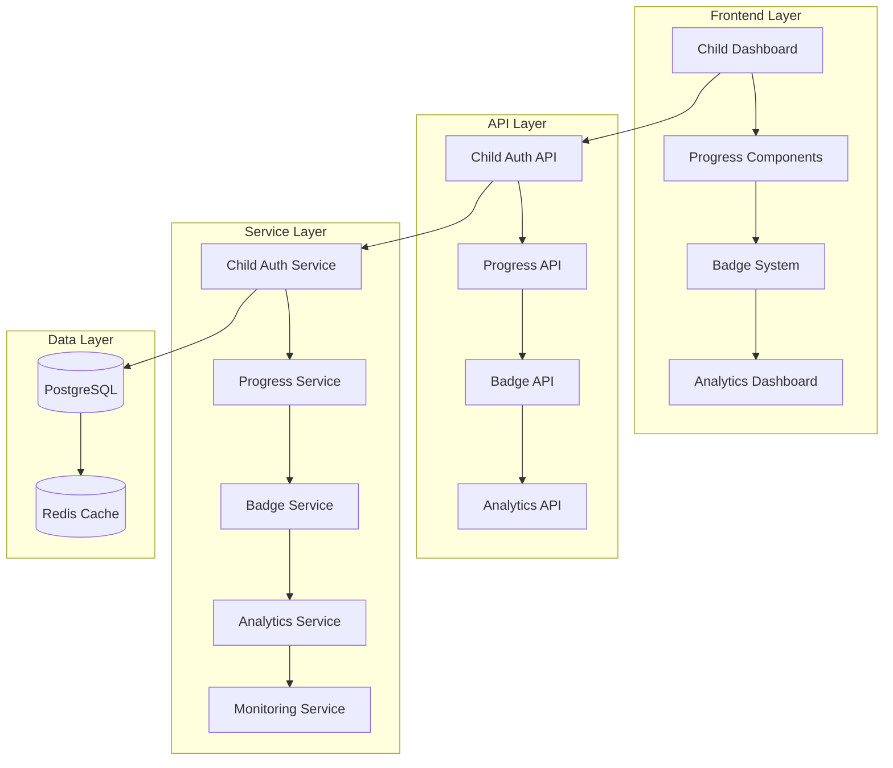

# Child Progress Module Documentation

## Overview

The Child Progress Module is a comprehensive system designed to provide children with an independent, gamified learning interface while maintaining robust parental oversight and safety features. This documentation provides complete guidance for implementation, deployment, and maintenance of the module.

## Documentation Structure

### 📚 Core Documentation

#### [API Documentation](./api-documentation.md)
Comprehensive API reference for all child-specific endpoints including:
- Child authentication and session management
- Progress tracking and analytics
- Badge system and achievements
- Real-time features and WebSocket APIs
- Error handling and security considerations

#### [Parent User Guide](./parent-user-guide.md)
Complete guide for parents on monitoring and managing their child's learning experience:
- Child account setup and security
- Progress monitoring dashboard
- Badge system understanding
- Safety features and notifications
- Reports and analytics interpretation
- Troubleshooting common issues

#### [Badge System Configuration](./badge-system-configuration.md)
Detailed configuration and customization guide for the badge system:
- Badge creation and management
- Eligibility rules engine
- Celebration system configuration
- Performance optimization
- Administration interface
- Troubleshooting and monitoring

### 🚀 Deployment Documentation

#### [Deployment Guide](../deployment/README.md)
Complete deployment instructions for all environments:
- Docker Compose deployment
- Kubernetes deployment
- Environment configuration
- Monitoring and observability
- Security considerations
- Backup and recovery procedures

#### [Environment Configuration](../deployment/environment-config.md)
Comprehensive environment setup guide:
- Environment variables reference
- Environment-specific configurations
- Docker and Kubernetes configuration
- Database and Redis setup
- Security and performance settings

## Quick Start Guide

### For Developers

1. **Review the Requirements and Design**
   - Read [Requirements Document](../requirements.md)
   - Study [Design Document](../design.md)
   - Understand [Implementation Tasks](../tasks.md)

2. **Set Up Development Environment**
   ```bash
   # Clone repository and install dependencies
   git clone <repository-url>
   cd ai-study-planner
   npm install
   
   # Set up environment
   cp .env.example .env
   # Configure environment variables
   
   # Start development environment
   docker-compose up -d
   ```

3. **Implement Features**
   - Follow the [Implementation Tasks](../tasks.md)
   - Use [API Documentation](./api-documentation.md) for endpoint specifications
   - Reference [Badge System Configuration](./badge-system-configuration.md) for gamification features

### For System Administrators

1. **Prepare Deployment Environment**
   - Review [Environment Configuration](../deployment/environment-config.md)
   - Set up required infrastructure (database, Redis, etc.)
   - Configure security settings and certificates

2. **Deploy the System**
   ```bash
   # Use the deployment script
   ./.kiro/specs/child-progress-module/deployment/deploy-child-progress-module.sh production
   
   # Or deploy manually with Docker Compose
   docker-compose -f docker-compose.child-progress.yml up -d
   ```

3. **Configure Monitoring**
   - Set up health checks and alerts
   - Configure log aggregation
   - Enable performance monitoring

### For Parents and Educators

1. **Get Started with Child Monitoring**
   - Read the [Parent User Guide](./parent-user-guide.md)
   - Set up child accounts and security settings
   - Configure notification preferences

2. **Understand the Badge System**
   - Learn about badge categories and rewards
   - Set up custom achievement goals
   - Monitor badge effectiveness

3. **Use Analytics and Reports**
   - Access progress monitoring dashboard
   - Generate and interpret reports
   - Adjust learning goals based on analytics

## Key Features

### 🔐 Enhanced Child Authentication
- PIN-based secure login system
- Device tracking and session management
- Parental oversight and notifications
- Suspicious activity detection

### 📊 Real-time Progress Tracking
- Live activity completion updates
- Learning streak calculation and maintenance
- Subject-specific progress monitoring
- Historical progress analysis

### 🏅 Gamified Badge System
- Automatic badge eligibility checking
- Customizable celebration animations
- Progress tracking toward achievements
- Rarity-based motivation system

### 👨‍👩‍👧‍👦 Parental Monitoring
- Comprehensive activity oversight
- Real-time notifications and alerts
- Detailed progress reports
- Safety and security monitoring

### 📱 Child-Friendly Interface
- Age-appropriate design and interactions
- Engaging animations and feedback
- Accessibility compliance
- Mobile and tablet optimization

### 🔍 Advanced Analytics
- Learning pattern analysis
- Performance trend identification
- Help-seeking behavior insights
- Personalized recommendations

## Architecture Overview



## Security and Compliance

### Child Data Protection
- **COPPA Compliance**: Full compliance with Children's Online Privacy Protection Act
- **Data Minimization**: Collect only necessary data for educational purposes
- **Secure Storage**: Encrypted data storage and transmission
- **Parental Control**: Complete parental oversight and control

### Authentication Security
- **PIN-based Authentication**: Child-friendly but secure authentication
- **Session Management**: Automatic timeouts and security monitoring
- **Device Tracking**: Monitor and control device access
- **Emergency Features**: Instant logout and account suspension capabilities

### Privacy Protection
- **No Social Features**: Isolated child accounts with no inter-user communication
- **Content Safety**: Comprehensive content filtering and safety monitoring
- **Activity Logging**: Secure logging for safety and educational insights
- **Data Retention**: Appropriate data retention policies

## Performance and Scalability

### Caching Strategy
- **Multi-level Caching**: Redis caching for different data types
- **Cache Optimization**: Optimized TTL settings for different use cases
- **Real-time Updates**: Efficient cache invalidation for real-time features

### Database Optimization
- **Optimized Indexes**: Performance-tuned database indexes
- **Query Optimization**: Efficient queries for badge eligibility and progress tracking
- **Connection Pooling**: Optimized database connection management

### Scalability Features
- **Horizontal Scaling**: Support for multiple application instances
- **Load Balancing**: Efficient request distribution
- **Auto-scaling**: Kubernetes-based automatic scaling
- **Performance Monitoring**: Comprehensive performance metrics and alerting

## Support and Maintenance

### Documentation Updates
This documentation is actively maintained and updated with each release. For the latest information:
- Check the [GitHub repository](https://github.com/your-org/ai-study-planner) for updates
- Review [release notes](../CHANGELOG.md) for new features and changes
- Submit documentation improvements via pull requests

### Getting Help

#### For Technical Issues
- **API Issues**: Check [API Documentation](./api-documentation.md) and error codes
- **Deployment Issues**: Review [Deployment Guide](../deployment/README.md) troubleshooting section
- **Configuration Issues**: Consult [Environment Configuration](../deployment/environment-config.md)

#### For User Support
- **Parent Questions**: Reference [Parent User Guide](./parent-user-guide.md) FAQ section
- **Badge System**: Check [Badge System Configuration](./badge-system-configuration.md) troubleshooting
- **Performance Issues**: Review monitoring dashboards and performance metrics

#### Support Channels
- **Documentation**: This comprehensive documentation set
- **Issue Tracking**: GitHub Issues for bug reports and feature requests
- **Community Support**: Community forums and discussion groups
- **Professional Support**: Enterprise support options available

### Contributing

We welcome contributions to improve the Child Progress Module:

1. **Code Contributions**: Follow the development guidelines in the main repository
2. **Documentation**: Help improve and expand this documentation
3. **Testing**: Contribute test cases and quality assurance
4. **Feedback**: Provide feedback on features and usability

### Version Information

- **Current Version**: 1.0.0
- **Last Updated**: 2024-08-26
- **Compatibility**: Node.js 18+, React 18+, PostgreSQL 13+, Redis 6+
- **Browser Support**: Modern browsers (Chrome 90+, Firefox 88+, Safari 14+, Edge 90+)

## Conclusion

The Child Progress Module represents a comprehensive solution for child-centered learning with robust parental oversight. This documentation provides all the necessary information to successfully implement, deploy, and maintain the system.

For additional support or questions not covered in this documentation, please refer to the support channels listed above or contact the development team directly.

---

**Next Steps:**
1. Review the [Requirements Document](../requirements.md) to understand the full scope
2. Study the [Design Document](../design.md) for architectural details
3. Follow the [Implementation Tasks](../tasks.md) for development
4. Use the [Deployment Guide](../deployment/README.md) for system deployment
5. Reference this documentation during development and maintenance

Happy learning! 🎓✨