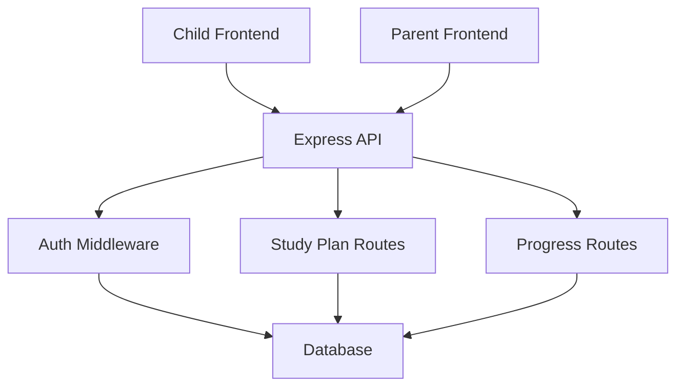
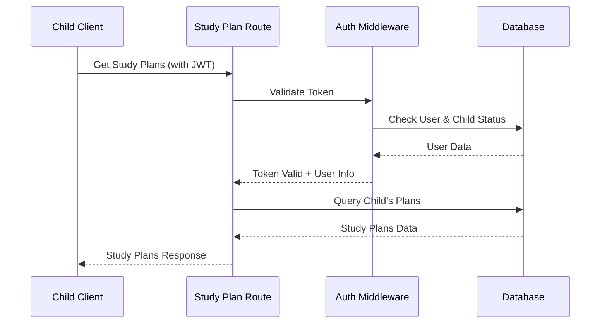
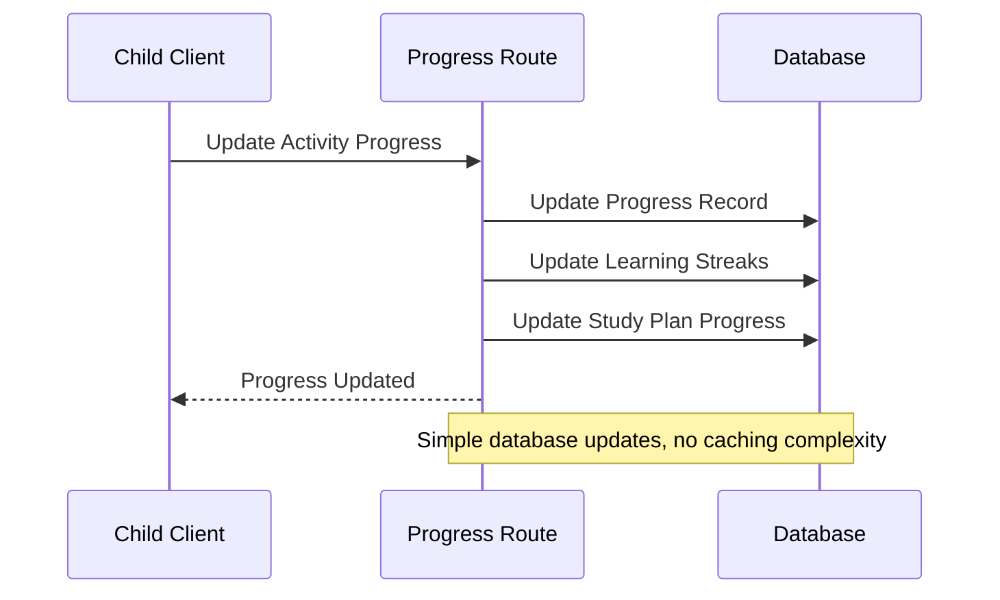

# Child Study Plan Access Fix - Design Document

## Overview

This design addresses critical issues in the child study plan access system by implementing robust authentication, progress tracking, and comprehensive error handling. The solution focuses on getting the core functionality working first with a simple, reliable approach that can be enhanced later.

## Architecture

### System Components



### Authentication Flow



### Progress Update Flow



## Components and Interfaces

### 1. Study Plan Access Issues Analysis

**Current Problem:** Children cannot access their study plans properly.

**Root Cause Analysis:**
- Study plan routes only return ACTIVE status plans for children
- User ID validation may be incorrect (parent ID vs child ID)
- Missing or incomplete plan data in responses
- Progress data not properly calculated or included

**Key Issues to Fix:**
- Allow children to access ALL their study plans (ACTIVE, DRAFT, PAUSED)
- Fix user ID comparison logic in routes
- Include complete progress data with study plans
- Handle cases where no study plans exist

### 2. Fixed Study Plan Access Routes

**Current Issue:** Routes filter to only show ACTIVE plans and may have incorrect user validation.

**Solution:** Modify routes to show all accessible plans with proper progress data.

**Implementation Changes:**
```typescript
// BEFORE: Only shows ACTIVE plans
const plans = await prisma.studyPlan.findMany({
  where: { 
    childId,
    status: 'ACTIVE' // This is the problem!
  }
});

// AFTER: Show all plans the child should see
const plans = await prisma.studyPlan.findMany({
  where: { childId },
  include: {
    activities: {
      include: {
        progressRecords: {
          where: { childId }
        }
      },
      orderBy: { createdAt: 'asc' }
    }
  },
  orderBy: { createdAt: 'desc' }
});

// Calculate progress for each plan
const plansWithProgress = plans.map(plan => ({
  ...plan,
  totalActivities: plan.activities.length,
  completedActivities: plan.activities.filter(a => 
    a.progressRecords.some(p => p.status === 'COMPLETED')
  ).length,
  progressPercentage: plan.activities.length > 0 
    ? (plan.activities.filter(a => 
        a.progressRecords.some(p => p.status === 'COMPLETED')
      ).length / plan.activities.length) * 100 
    : 0
}));
```

### 3. Progress Update Routes

**Current Issue:** Progress updates may not be working properly or not reflecting in dashboards.

**Solution:** Create/fix progress update endpoints and ensure data flows correctly.

**Implementation:**
```typescript
// Add missing progress update route
router.post('/child/:childId/activity/:activityId/progress', authenticateToken, requireChild, async (req, res) => {
  try {
    const { childId, activityId } = req.params;
    const { timeSpent, score, status, sessionData } = req.body;
    
    // Verify child access
    if (req.user?.userId !== childId) {
      return res.status(403).json({ error: 'Access denied' });
    }
    
    // Update progress
    const progress = await prisma.progressRecord.upsert({
      where: { 
        childId_activityId: { childId, activityId } 
      },
      update: {
        timeSpent: { increment: timeSpent || 0 },
        score: score,
        status: status,
        sessionData: sessionData,
        updatedAt: new Date()
      },
      create: {
        childId,
        activityId,
        timeSpent: timeSpent || 0,
        score: score || 0,
        status: status || 'IN_PROGRESS',
        sessionData: sessionData || {},
        attempts: 1
      }
    });
    
    // Update streaks if completed
    if (status === 'COMPLETED') {
      await childProgressService.updateLearningStreaks(childId, 'general', score || 0);
    }
    
    res.json({ progress, message: 'Progress updated successfully' });
  } catch (error) {
    logger.error('Error updating progress:', error);
    res.status(500).json({ error: 'Failed to update progress' });
  }
});
```

### 4. Dashboard Data Integration

**Current Issue:** Child and parent dashboards may not show updated progress correctly.

**Solution:** Ensure dashboard APIs return complete, up-to-date progress data.

**Implementation:**
```typescript
// Fix child dashboard API to include all necessary data
router.get('/child/:childId/dashboard', authenticateToken, requireChild, async (req, res) => {
  try {
    const { childId } = req.params;
    
    // Get study plans with progress
    const studyPlans = await prisma.studyPlan.findMany({
      where: { childId },
      include: {
        activities: {
          include: {
            progressRecords: { where: { childId } }
          }
        }
      }
    });
    
    // Calculate progress summary
    const progressSummary = await childProgressService.generateProgressSummary(childId);
    
    // Get current streaks
    const streaks = await childProgressService.getLearningStreaks(childId);
    
    // Format response
    const dashboardData = {
      child: { id: childId },
      progressSummary,
      studyPlans: studyPlans.map(plan => ({
        ...plan,
        totalActivities: plan.activities.length,
        completedActivities: plan.activities.filter(a => 
          a.progressRecords.some(p => p.status === 'COMPLETED')
        ).length,
        progressPercentage: plan.activities.length > 0 
          ? (plan.activities.filter(a => 
              a.progressRecords.some(p => p.status === 'COMPLETED')
            ).length / plan.activities.length) * 100 
          : 0
      })),
      currentStreaks: streaks,
      badges: {
        recent: [], // Add badge logic as needed
        progress: [],
        nextToEarn: []
      },
      dailyGoals: {
        activitiesTarget: 5,
        activitiesCompleted: progressSummary.completedActivities || 0,
        timeTarget: 1800, // 30 minutes
        timeSpent: progressSummary.totalTimeSpent || 0
      }
    };
    
    res.json(dashboardData);
  } catch (error) {
    logger.error('Error getting dashboard data:', error);
    res.status(500).json({ error: 'Failed to load dashboard data' });
  }
});
```

## Data Models

### Enhanced Progress Record (Simplified)

```typescript
interface ProgressRecord {
  id: string;
  childId: string;
  activityId: string;
  status: 'NOT_STARTED' | 'IN_PROGRESS' | 'COMPLETED';
  score: number;
  timeSpent: number; // seconds
  attempts: number;
  completedAt?: Date;
  createdAt: Date;
  updatedAt: Date;
}
```

### Study Plan with Progress

```typescript
interface StudyPlanWithProgress {
  id: string;
  childId: string;
  subject: string;
  status: string;
  activities: ActivityWithProgress[];
  totalActivities: number;
  completedActivities: number;
  progressPercentage: number;
}

interface ActivityWithProgress {
  id: string;
  title: string;
  description: string;
  estimatedDuration: number;
  progressRecord?: ProgressRecord;
}
```

## Error Handling

### Simple Error Response Format

```typescript
interface ErrorResponse {
  error: {
    code: string;
    message: string;
    timestamp: string;
  };
}
```

### Child-Friendly Error Messages

```typescript
const getChildFriendlyMessage = (error) => {
  const messages = {
    'AUTHENTICATION_FAILED': "Let's try logging in again! 🔑",
    'PLAN_NOT_FOUND': "We can't find that study plan 📚",
    'NETWORK_ERROR': "Having trouble connecting 🌐",
    'PROGRESS_SAVE_FAILED': "Your progress is safe! Just a tiny hiccup 💾"
  };
  
  return messages[error.code] || "Something went wrong, but we're fixing it! 🛠️";
};
```

## Testing Strategy

### Unit Tests
1. Authentication middleware validation
2. Progress calculation accuracy
3. Study plan access control
4. Error handling scenarios

### Integration Tests
1. Child login → study plan access → progress update flow
2. Parent dashboard progress visibility
3. Cross-browser compatibility

### Manual Testing Scenarios
1. Child accesses study plans after login
2. Child completes activities and sees progress
3. Parent sees updated progress in dashboard
4. Error scenarios (network issues, invalid tokens)

## Performance Optimization (Simple Approach)

### Database Optimization
1. **Proper Indexing**
   ```sql
   CREATE INDEX idx_progress_child_activity ON progress_records(child_id, activity_id);
   CREATE INDEX idx_study_plans_child ON study_plans(child_id);
   CREATE INDEX idx_streaks_child ON learning_streaks(child_id);
   ```

2. **Efficient Queries**
   - Use `include` for related data in single queries
   - Avoid N+1 query problems
   - Use database transactions for consistency

### Frontend Optimization
1. **Loading States**
   - Show loading indicators during API calls
   - Implement retry mechanisms for failed requests
   - Graceful degradation with mock data

2. **Error Recovery**
   - Automatic retry for network failures
   - Clear error messages with action buttons
   - Fallback to cached data when available

## Security Considerations

### Authentication Security
1. **JWT Validation**
   - Verify token signature and expiration
   - Extract correct user ID from token payload
   - Validate child profile existence

2. **Access Control**
   - Ensure children can only access their own data
   - Validate parent-child relationships
   - Implement proper role-based access

### Data Protection
1. **Input Validation**
   - Validate all progress update data
   - Sanitize user inputs
   - Prevent SQL injection with parameterized queries

2. **Error Information**
   - Don't expose sensitive data in error messages
   - Log detailed errors server-side only
   - Provide user-friendly messages to clients

## Implementation Priority

### Phase 1: Core Fixes (High Priority)
1. Fix child authentication middleware
2. Remove ACTIVE-only filtering from study plan access
3. Fix progress update logic
4. Implement proper error handling

### Phase 2: Dashboard Updates (Medium Priority)
1. Update child dashboard to show all plans
2. Fix progress calculation and display
3. Ensure parent dashboard reflects child progress
4. Add loading states and error recovery

### Phase 3: Polish and Testing (Low Priority)
1. Comprehensive testing suite
2. Performance optimization
3. Enhanced error messages
4. User experience improvements

This simplified approach focuses on getting the basic functionality working reliably before adding complex features like real-time updates or advanced caching.