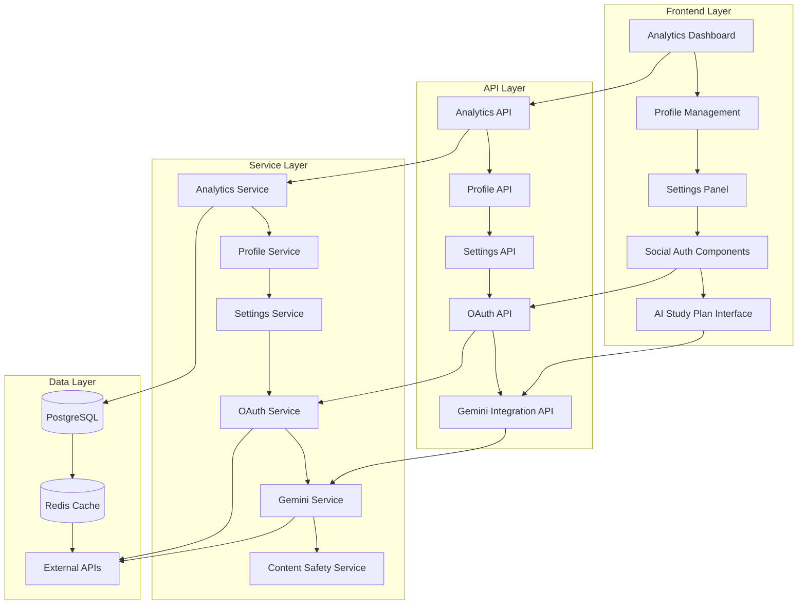

# Design Document

## Overview

This design document outlines the implementation of enhanced user experience features including comprehensive analytics, user profile management, settings configuration, social authentication (Google, Apple, Instagram), and AI-powered study plan generation using Gemini Pro API. The design builds upon the existing architecture while adding new components and services to support these features.

## Architecture

### High-Level Architecture



### Database Schema Extensions

The existing schema will be extended with the following new tables and modifications:

```sql
-- Social authentication providers
CREATE TABLE social_auth_providers (
  id VARCHAR PRIMARY KEY DEFAULT gen_random_uuid(),
  user_id VARCHAR NOT NULL REFERENCES users(id) ON DELETE CASCADE,
  provider VARCHAR NOT NULL, -- 'google', 'apple', 'instagram'
  provider_user_id VARCHAR NOT NULL,
  provider_email VARCHAR,
  provider_name VARCHAR,
  access_token_encrypted TEXT,
  refresh_token_encrypted TEXT,
  token_expires_at TIMESTAMP,
  created_at TIMESTAMP DEFAULT NOW(),
  updated_at TIMESTAMP DEFAULT NOW(),
  UNIQUE(provider, provider_user_id)
);

-- User settings
CREATE TABLE user_settings (
  id VARCHAR PRIMARY KEY DEFAULT gen_random_uuid(),
  user_id VARCHAR NOT NULL REFERENCES users(id) ON DELETE CASCADE,
  theme VARCHAR DEFAULT 'light', -- 'light', 'dark', 'auto'
  language VARCHAR DEFAULT 'en',
  timezone VARCHAR DEFAULT 'UTC',
  email_notifications BOOLEAN DEFAULT true,
  push_notifications BOOLEAN DEFAULT true,
  privacy_level VARCHAR DEFAULT 'standard', -- 'minimal', 'standard', 'full'
  data_sharing_consent BOOLEAN DEFAULT false,
  created_at TIMESTAMP DEFAULT NOW(),
  updated_at TIMESTAMP DEFAULT NOW(),
  UNIQUE(user_id)
);

-- Child settings (extends existing child_profiles)
CREATE TABLE child_settings (
  id VARCHAR PRIMARY KEY DEFAULT gen_random_uuid(),
  child_id VARCHAR NOT NULL REFERENCES child_profiles(id) ON DELETE CASCADE,
  content_filter_level VARCHAR DEFAULT 'moderate', -- 'strict', 'moderate', 'relaxed'
  session_time_limit INTEGER DEFAULT 60, -- minutes
  break_reminders BOOLEAN DEFAULT true,
  parental_notifications BOOLEAN DEFAULT true,
  ai_assistance_enabled BOOLEAN DEFAULT true,
  video_autoplay BOOLEAN DEFAULT false,
  created_at TIMESTAMP DEFAULT NOW(),
  updated_at TIMESTAMP DEFAULT NOW(),
  UNIQUE(child_id)
);

-- Study content (videos and articles)
CREATE TABLE study_content (
  id VARCHAR PRIMARY KEY DEFAULT gen_random_uuid(),
  activity_id VARCHAR NOT NULL REFERENCES study_activities(id) ON DELETE CASCADE,
  content_type VARCHAR NOT NULL, -- 'video', 'article', 'interactive'
  title VARCHAR NOT NULL,
  description TEXT,
  content_url VARCHAR,
  thumbnail_url VARCHAR,
  duration INTEGER, -- seconds for videos, estimated reading time for articles
  difficulty_level INTEGER DEFAULT 1, -- 1-10
  age_appropriate_min INTEGER DEFAULT 5,
  age_appropriate_max INTEGER DEFAULT 18,
  safety_rating VARCHAR DEFAULT 'safe', -- 'safe', 'review_needed', 'blocked'
  source_attribution TEXT,
  created_at TIMESTAMP DEFAULT NOW(),
  updated_at TIMESTAMP DEFAULT NOW()
);

-- Content interactions tracking
CREATE TABLE content_interactions (
  id VARCHAR PRIMARY KEY DEFAULT gen_random_uuid(),
  child_id VARCHAR NOT NULL REFERENCES child_profiles(id) ON DELETE CASCADE,
  content_id VARCHAR NOT NULL REFERENCES study_content(id) ON DELETE CASCADE,
  interaction_type VARCHAR NOT NULL, -- 'view', 'complete', 'like', 'bookmark'
  progress_percentage INTEGER DEFAULT 0,
  time_spent INTEGER DEFAULT 0, -- seconds
  created_at TIMESTAMP DEFAULT NOW(),
  UNIQUE(child_id, content_id, interaction_type)
);
```

## Components and Interfaces

### Frontend Components

#### 1. Enhanced Analytics Dashboard
- **Location**: `frontend/src/components/analytics/`
- **Components**:
  - `EnhancedAnalyticsDashboard.tsx` - Main dashboard with expanded metrics
  - `DetailedProgressChart.tsx` - Interactive progress visualization
  - `LearningInsights.tsx` - AI-powered insights panel
  - `ExportReports.tsx` - Report generation and export functionality

#### 2. Profile Management System
- **Location**: `frontend/src/components/profile/`
- **Components**:
  - `UserProfilePage.tsx` - Main profile management interface
  - `ProfileEditor.tsx` - Editable profile form
  - `AvatarUpload.tsx` - Profile picture management
  - `AccountLinking.tsx` - Social account connection management

#### 3. Settings Management
- **Location**: `frontend/src/components/settings/`
- **Components**:
  - `SettingsPage.tsx` - Main settings interface
  - `GeneralSettings.tsx` - Basic preferences
  - `PrivacySettings.tsx` - Privacy and data controls
  - `NotificationSettings.tsx` - Communication preferences
  - `ChildSafetySettings.tsx` - Child-specific safety controls

#### 4. Social Authentication
- **Location**: `frontend/src/components/auth/`
- **Components**:
  - `SocialLoginButtons.tsx` - OAuth provider buttons
  - `OAuthCallback.tsx` - OAuth callback handler
  - `AccountLinkingModal.tsx` - Link/unlink social accounts

#### 5. AI Study Plan Interface
- **Location**: `frontend/src/components/studyPlan/`
- **Components**:
  - `AIStudyPlanGenerator.tsx` - Gemini-powered plan creation
  - `ContentPreview.tsx` - Video/article preview component
  - `ContentPlayer.tsx` - Unified media player
  - `ContentSafetyIndicator.tsx` - Safety rating display

### Backend Services

#### 1. Enhanced Analytics Service
- **Location**: `backend/src/services/enhancedAnalyticsService.ts`
- **Responsibilities**:
  - Advanced progress tracking and analysis
  - Learning pattern recognition
  - Performance prediction algorithms
  - Report generation and caching

#### 2. Profile Management Service
- **Location**: `backend/src/services/profileService.ts`
- **Responsibilities**:
  - User profile CRUD operations
  - Profile validation and sanitization
  - Avatar upload and processing
  - Profile data export/import

#### 3. Settings Service
- **Location**: `backend/src/services/settingsService.ts`
- **Responsibilities**:
  - User and child settings management
  - Settings validation and defaults
  - Privacy preference enforcement
  - Settings synchronization

#### 4. OAuth Service
- **Location**: `backend/src/services/oauthService.ts`
- **Responsibilities**:
  - OAuth flow management for Google, Apple, Instagram
  - Token encryption and secure storage
  - Account linking and unlinking
  - Provider-specific data handling

#### 5. Gemini Integration Service
- **Location**: `backend/src/services/geminiService.ts`
- **Responsibilities**:
  - Gemini Pro API integration
  - Study plan generation with content recommendations
  - Content safety validation
  - Response caching and optimization

#### 6. Content Management Service
- **Location**: `backend/src/services/contentService.ts`
- **Responsibilities**:
  - Video and article content management
  - Content safety screening
  - Content recommendation algorithms
  - Content interaction tracking

## Data Models

### Enhanced User Model
```typescript
interface EnhancedUser extends User {
  settings: UserSettings;
  socialProviders: SocialAuthProvider[];
  profilePicture?: string;
  lastLoginAt: Date;
  loginCount: number;
}

interface UserSettings {
  theme: 'light' | 'dark' | 'auto';
  language: string;
  timezone: string;
  emailNotifications: boolean;
  pushNotifications: boolean;
  privacyLevel: 'minimal' | 'standard' | 'full';
  dataSharingConsent: boolean;
}

interface SocialAuthProvider {
  provider: 'google' | 'apple' | 'instagram';
  providerUserId: string;
  providerEmail?: string;
  providerName?: string;
  isLinked: boolean;
  linkedAt: Date;
}
```

### Enhanced Child Profile Model
```typescript
interface EnhancedChildProfile extends ChildProfile {
  settings: ChildSettings;
  contentInteractions: ContentInteraction[];
  learningInsights: LearningInsight[];
}

interface ChildSettings {
  contentFilterLevel: 'strict' | 'moderate' | 'relaxed';
  sessionTimeLimit: number; // minutes
  breakReminders: boolean;
  parentalNotifications: boolean;
  aiAssistanceEnabled: boolean;
  videoAutoplay: boolean;
}

interface ContentInteraction {
  contentId: string;
  interactionType: 'view' | 'complete' | 'like' | 'bookmark';
  progressPercentage: number;
  timeSpent: number; // seconds
  timestamp: Date;
}
```

### Study Content Model
```typescript
interface StudyContent {
  id: string;
  activityId: string;
  contentType: 'video' | 'article' | 'interactive';
  title: string;
  description: string;
  contentUrl: string;
  thumbnailUrl?: string;
  duration: number; // seconds for videos, estimated reading time for articles
  difficultyLevel: number; // 1-10
  ageAppropriate: {
    min: number;
    max: number;
  };
  safetyRating: 'safe' | 'review_needed' | 'blocked';
  sourceAttribution: string;
  metadata: {
    tags: string[];
    subject: string;
    curriculum: string[];
  };
}
```

### Gemini Integration Models
```typescript
interface GeminiStudyPlanRequest {
  childAge: number;
  gradeLevel: string;
  subject: string;
  learningStyle: LearningStyle;
  duration: number; // minutes
  objectives: string[];
  previousPerformance?: PerformanceData;
}

interface GeminiStudyPlanResponse {
  planId: string;
  activities: GeminiActivity[];
  estimatedDuration: number;
  difficultyProgression: number[];
  contentRecommendations: ContentRecommendation[];
}

interface ContentRecommendation {
  type: 'video' | 'article';
  title: string;
  description: string;
  url: string;
  duration: number;
  ageAppropriate: boolean;
  safetyScore: number;
}
```

## Error Handling

### OAuth Error Handling
- **Provider Unavailable**: Graceful fallback to email/password login
- **Token Expiration**: Automatic refresh with user notification
- **Account Conflicts**: Clear resolution flow for duplicate accounts
- **Permission Denied**: Informative error messages with retry options

### Gemini API Error Handling
- **Rate Limiting**: Implement exponential backoff and request queuing
- **Content Safety Violations**: Automatic content filtering and parent notification
- **API Unavailable**: Fallback to cached content or manual plan creation
- **Invalid Responses**: Content validation and error recovery

### Content Safety Error Handling
- **Inappropriate Content**: Automatic blocking with parent notification
- **Broken Links**: Content validation and alternative suggestions
- **Age Inappropriate**: Automatic filtering based on child age settings

## Testing Strategy

### Unit Testing
- **OAuth Service Tests**: Mock provider responses and test all authentication flows
- **Gemini Service Tests**: Mock API responses and test content generation
- **Analytics Service Tests**: Test calculation accuracy and performance
- **Settings Service Tests**: Validate settings persistence and synchronization

### Integration Testing
- **OAuth Flow Tests**: End-to-end authentication with test accounts
- **Content Safety Tests**: Validate filtering and safety mechanisms
- **Analytics Pipeline Tests**: Test data flow from activities to reports
- **Settings Synchronization Tests**: Test cross-device settings sync

### Security Testing
- **OAuth Security**: Test PKCE implementation and token security
- **Data Privacy**: Validate privacy settings enforcement
- **Content Safety**: Test inappropriate content detection
- **API Security**: Validate rate limiting and authentication

### Performance Testing
- **Analytics Dashboard**: Test with large datasets and multiple children
- **Content Loading**: Test video/article loading performance
- **Gemini API**: Test response times and caching effectiveness
- **Database Queries**: Optimize complex analytics queries

## Security Considerations

### OAuth Security
- Implement PKCE (Proof Key for Code Exchange) for mobile apps
- Secure token storage using encryption at rest
- Regular token rotation and validation
- Scope limitation to minimum required permissions

### Data Privacy
- GDPR/COPPA compliance for child data
- Granular privacy controls for parents
- Data minimization principles
- Secure data export and deletion

### Content Safety
- Multi-layer content filtering system
- Real-time safety monitoring
- Parent notification system for flagged content
- Age-appropriate content validation

### API Security
- Rate limiting for Gemini API calls
- Input validation and sanitization
- Secure API key management
- Request/response logging for audit

## Performance Optimization

### Caching Strategy
- Redis caching for analytics data (1-hour TTL)
- Content metadata caching (24-hour TTL)
- User settings caching (session-based)
- Gemini response caching (content-based, 7-day TTL)

### Database Optimization
- Indexed queries for analytics aggregation
- Partitioned tables for large datasets
- Connection pooling optimization
- Query result caching

### Frontend Optimization
- Lazy loading for analytics components
- Virtual scrolling for large content lists
- Image optimization and CDN usage
- Progressive web app features

### API Optimization
- Batch API requests where possible
- Pagination for large datasets
- Compression for API responses
- CDN for static content delivery