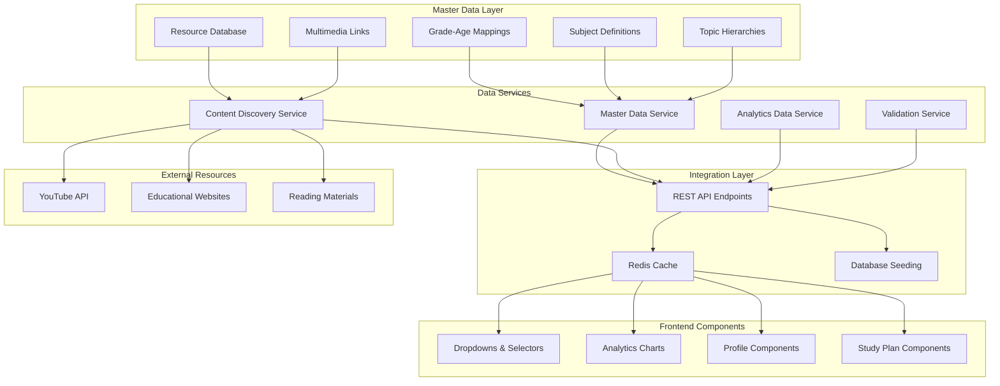

# Design Document

## Overview

The Master Data System provides a comprehensive, centralized foundation for educational content in the AI Study Planner application. This system establishes standardized data structures for grades, subjects, topics, and multimedia resources while integrating seamlessly with existing components to provide real analytics data and consistent UI experiences. The design focuses on creating a scalable, maintainable data architecture that supports both current functionality and future educational content expansion.

## Architecture

### High-Level Architecture



### Technology Integration

- **Backend**: Enhanced Node.js services with TypeScript interfaces
- **Database**: PostgreSQL with Prisma ORM for master data storage
- **Cache**: Redis for frequently accessed master data
- **Frontend**: React components with Material-UI for consistent styling
- **Charts**: Recharts for analytics visualization with real data
- **Validation**: Zod schemas for master data integrity

## Components and Interfaces

### Master Data Service Interface

```typescript
interface MasterDataService {
  // Grade and Age Management
  getAllGrades(): Promise<GradeLevel[]>
  getGradeByAge(age: number): Promise<GradeLevel | null>
  getAgeRangeByGrade(grade: string): Promise<AgeRange>
  
  // Subject Management
  getSubjectsByGrade(grade: string): Promise<Subject[]>
  getAllSubjects(): Promise<Subject[]>
  getSubjectById(subjectId: string): Promise<Subject | null>
  
  // Topic Management
  getTopicsBySubject(grade: string, subjectId: string): Promise<Topic[]>
  getTopicHierarchy(grade: string): Promise<TopicHierarchy>
  getTopicById(topicId: string): Promise<Topic | null>
  
  // Resource Management
  getResourcesByTopic(topicId: string): Promise<EducationalResource[]>
  getYouTubeVideosByTopic(topicId: string, grade: string): Promise<YouTubeResource[]>
  getReadingMaterialsByTopic(topicId: string, grade: string): Promise<ReadingResource[]>
  
  // Validation and Integrity
  validateMasterData(): Promise<ValidationResult>
  updateResourceAvailability(): Promise<ResourceStatus[]>
}
```

### Enhanced Analytics Service Interface

```typescript
interface EnhancedAnalyticsService {
  // Real Data Analytics
  generateRealProgressReport(childId: string, timeFrame: TimeFrame): Promise<DetailedProgressReport>
  calculateSubjectProficiency(childId: string, subjectId: string): Promise<ProficiencyLevel>
  getSkillLevelVisualization(childId: string): Promise<SkillVisualization>
  
  // Master Data Integration
  getProgressByMasterDataStructure(childId: string): Promise<StructuredProgress>
  generateComprehensiveAnalytics(childId: string): Promise<ComprehensiveAnalytics>
  
  // Mock Data Generation
  generateRealisticMockData(childId: string, masterDataStructure: MasterDataStructure): Promise<MockAnalyticsData>
  seedAnalyticsWithMasterData(): Promise<SeedResult>
}
```

### UI Consistency Service Interface

```typescript
interface UIConsistencyService {
  // Theme and Styling
  getConsistentTheme(): Promise<ConsistentTheme>
  getComponentStyleGuide(): Promise<StyleGuide>
  validateUIConsistency(componentName: string): Promise<ConsistencyReport>
  
  // Component Standards
  getStandardizedDropdowns(): Promise<DropdownConfig[]>
  getChartingStandards(): Promise<ChartConfig>
  getVisualizationPalette(): Promise<ColorPalette>
}
```

## Data Models

### Master Data Core Models

```typescript
interface GradeLevel {
  id: string
  grade: string
  displayName: string
  ageRange: AgeRange
  educationalLevel: 'elementary' | 'middle' | 'high'
  prerequisites: string[]
  nextGrade?: string
  isActive: boolean
  createdAt: Date
  updatedAt: Date
}

interface AgeRange {
  min: number
  max: number
  typical: number
}

interface Subject {
  id: string
  name: string
  displayName: string
  description: string
  icon: string
  color: string
  category: SubjectCategory
  gradeAvailability: string[]
  estimatedHoursPerGrade: Record<string, number>
  prerequisites: string[]
  isCore: boolean
  sortOrder: number
  createdAt: Date
  updatedAt: Date
}

interface Topic {
  id: string
  name: string
  displayName: string
  description: string
  subjectId: string
  grade: string
  difficulty: DifficultyLevel
  estimatedHours: number
  prerequisites: string[]
  learningObjectives: string[]
  skills: string[]
  resources: TopicResource[]
  assessmentCriteria: AssessmentCriteria[]
  sortOrder: number
  isActive: boolean
  createdAt: Date
  updatedAt: Date
}

interface TopicResource {
  id: string
  topicId: string
  type: ResourceType
  title: string
  description: string
  url: string
  thumbnailUrl?: string
  duration?: number
  difficulty: DifficultyLevel
  ageAppropriate: boolean
  safetyRating: SafetyRating
  source: string
  tags: string[]
  lastValidated: Date
  isActive: boolean
}

interface YouTubeResource extends TopicResource {
  videoId: string
  channelName: string
  publishedAt: Date
  viewCount?: number
  likeCount?: number
  transcript?: string
  closedCaptions: boolean
}

interface ReadingResource extends TopicResource {
  author?: string
  publisher?: string
  isbn?: string
  readingLevel: string
  wordCount?: number
  language: string
  format: 'pdf' | 'html' | 'epub' | 'external'
}
```

### Enhanced Analytics Models

```typescript
interface DetailedProgressReport extends ProgressReport {
  subjectBreakdown: SubjectProgressDetail[]
  topicMastery: TopicMasteryDetail[]
  skillDevelopment: SkillDevelopmentTrack[]
  learningPatterns: LearningPattern[]
  recommendations: PersonalizedRecommendation[]
  parentInsights: ParentInsight[]
}

interface SubjectProgressDetail {
  subjectId: string
  subjectName: string
  overallProgress: number
  proficiencyLevel: ProficiencyLevel
  topicsCompleted: number
  totalTopics: number
  averageScore: number
  timeSpent: number
  strengthAreas: string[]
  improvementAreas: string[]
  nextRecommendedTopics: string[]
  masteryTrend: 'improving' | 'stable' | 'declining'
}

interface TopicMasteryDetail {
  topicId: string
  topicName: string
  subjectId: string
  masteryLevel: number
  attemptsCount: number
  averageScore: number
  timeSpent: number
  lastActivity: Date
  status: TopicStatus
  difficultyProgression: DifficultyProgression[]
  resourcesUsed: ResourceUsage[]
}

interface SkillVisualization {
  childId: string
  overallLevel: ProficiencyLevel
  subjectProficiencies: SubjectProficiency[]
  skillRadarChart: RadarChartData
  progressTimeline: TimelineData[]
  achievementBadges: Achievement[]
  nextMilestones: Milestone[]
}

interface SubjectProficiency {
  subjectId: string
  subjectName: string
  proficiencyLevel: ProficiencyLevel
  proficiencyScore: number
  visualIndicator: VisualIndicator
  topicBreakdown: TopicProficiency[]
  trendDirection: 'up' | 'down' | 'stable'
  confidenceLevel: number
}

interface VisualIndicator {
  type: 'progress-bar' | 'circular-progress' | 'star-rating' | 'level-badge'
  value: number
  maxValue: number
  color: string
  icon?: string
  animation?: AnimationConfig
}
```

### UI Consistency Models

```typescript
interface ConsistentTheme {
  colors: {
    primary: ColorScheme
    secondary: ColorScheme
    subjects: Record<string, string>
    proficiency: Record<ProficiencyLevel, string>
    status: Record<string, string>
  }
  typography: TypographyConfig
  spacing: SpacingConfig
  components: ComponentThemeConfig
}

interface StyleGuide {
  components: {
    cards: CardStyleConfig
    buttons: ButtonStyleConfig
    charts: ChartStyleConfig
    forms: FormStyleConfig
    navigation: NavigationStyleConfig
  }
  layouts: LayoutConfig
  animations: AnimationConfig
  accessibility: AccessibilityConfig
}

interface ChartConfig {
  defaultColors: string[]
  subjectColors: Record<string, string>
  proficiencyColors: Record<ProficiencyLevel, string>
  chartTypes: {
    progress: ChartTypeConfig
    performance: ChartTypeConfig
    comparison: ChartTypeConfig
    timeline: ChartTypeConfig
  }
  responsive: ResponsiveConfig
}
```

## Error Handling

### Master Data Validation

```typescript
interface ValidationResult {
  isValid: boolean
  errors: ValidationError[]
  warnings: ValidationWarning[]
  summary: ValidationSummary
}

interface ValidationError {
  type: 'missing_data' | 'invalid_reference' | 'constraint_violation' | 'format_error'
  entity: string
  field: string
  message: string
  severity: 'critical' | 'high' | 'medium' | 'low'
  suggestedFix?: string
}

interface ResourceStatus {
  resourceId: string
  url: string
  status: 'active' | 'broken' | 'moved' | 'restricted'
  lastChecked: Date
  responseTime?: number
  errorMessage?: string
  alternativeResources?: string[]
}
```

### Analytics Error Handling

- **Insufficient Data**: Graceful handling when analytics data is limited
- **Real-time Updates**: Error recovery for live data streaming
- **Chart Rendering**: Fallback displays for visualization failures
- **Performance Optimization**: Caching strategies for large datasets

## Testing Strategy

### Master Data Testing

```typescript
interface MasterDataTestSuite {
  // Data Integrity Tests
  validateGradeAgeConsistency(): Promise<TestResult>
  validateSubjectTopicRelationships(): Promise<TestResult>
  validateResourceAvailability(): Promise<TestResult>
  
  // Integration Tests
  testFrontendDataConsumption(): Promise<TestResult>
  testAnalyticsDataGeneration(): Promise<TestResult>
  testStudyPlanGeneration(): Promise<TestResult>
  
  // Performance Tests
  testDataLoadingPerformance(): Promise<PerformanceResult>
  testCacheEffectiveness(): Promise<CacheResult>
  testDatabaseQueryOptimization(): Promise<QueryResult>
}
```

### UI Consistency Testing

- **Visual Regression Testing**: Automated screenshot comparison
- **Component Consistency**: Standardized component behavior testing
- **Responsive Design**: Cross-device layout validation
- **Accessibility Compliance**: WCAG 2.1 AA standard verification

### Analytics Testing

- **Real Data Validation**: Accuracy of analytics calculations
- **Mock Data Generation**: Realistic test data creation
- **Chart Rendering**: Visual component testing
- **Performance Metrics**: Large dataset handling

## Implementation Phases

### Phase 1: Master Data Foundation
1. **Database Schema Enhancement**: Extend Prisma schema for master data
2. **Core Data Services**: Implement master data service layer
3. **Data Seeding**: Create comprehensive seed data
4. **Validation Framework**: Build data integrity validation

### Phase 2: Frontend Integration
1. **Component Updates**: Integrate master data into existing components
2. **Dropdown Standardization**: Consistent selector components
3. **Theme Unification**: Standardized styling across application
4. **Responsive Design**: Consistent layouts and breakpoints

### Phase 3: Enhanced Analytics
1. **Real Data Integration**: Connect analytics to actual user data
2. **Skill Visualization**: Implement proficiency level displays
3. **Chart Enhancements**: Rich, interactive data visualizations
4. **Performance Optimization**: Efficient data processing and caching

### Phase 4: Resource Management
1. **YouTube Integration**: Automated video resource discovery
2. **Reading Materials**: Curated educational content links
3. **Resource Validation**: Automated link checking and updates
4. **Content Safety**: Enhanced safety rating system

## Monitoring and Maintenance

### Data Quality Monitoring
- **Automated Validation**: Daily master data integrity checks
- **Resource Health**: Regular URL validation and updates
- **Usage Analytics**: Track master data utilization patterns
- **Performance Metrics**: Monitor query performance and optimization

### Content Management
- **Curriculum Updates**: Process for updating educational standards
- **Resource Curation**: Community-driven content recommendations
- **Safety Monitoring**: Continuous content appropriateness validation
- **Localization Support**: Multi-language content management

### System Scalability
- **Horizontal Scaling**: Database partitioning strategies
- **Caching Optimization**: Multi-level caching implementation
- **API Rate Limiting**: Efficient resource utilization
- **Content Delivery**: CDN integration for multimedia resources