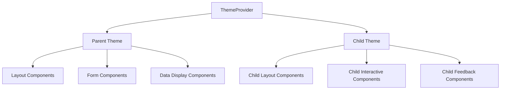
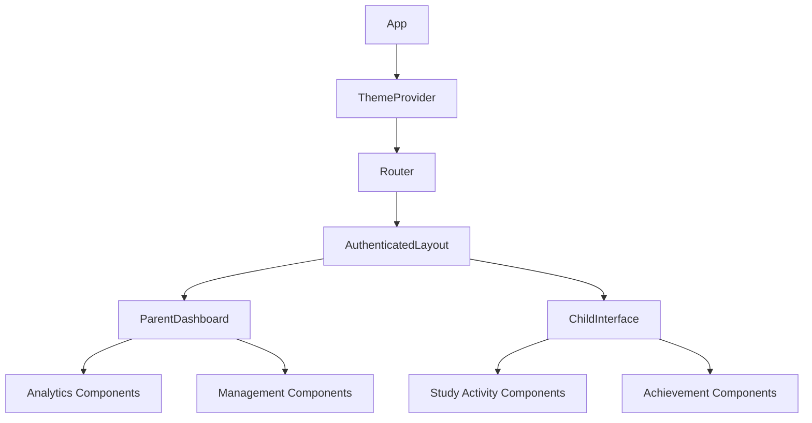
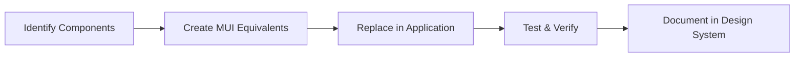

# Design Document: UI Improvement with Material Design

## Overview

This design document outlines the approach for implementing a consistent Material Design system across the AI Study Planner application. The goal is to create a visually cohesive, professional, and appealing user experience while ensuring accessibility and responsiveness.

## Architecture

### Material UI Integration

We will use Material UI (MUI) as our primary component library to implement Material Design principles. MUI provides a comprehensive set of pre-built React components that follow Material Design guidelines and offer customization options.

Key architectural decisions:
- Use MUI v5 with emotion as the styling solution
- Implement a centralized theme provider
- Create custom component wrappers when needed for specialized functionality
- Ensure all components are responsive by default

## Components and Interfaces

### Theme Configuration

We will create a centralized theme configuration that defines:

```typescript
// Theme structure
interface AppTheme {
  palette: {
    primary: ColorObject;
    secondary: ColorObject;
    error: ColorObject;
    warning: ColorObject;
    info: ColorObject;
    success: ColorObject;
    background: {
      default: string;
      paper: string;
    };
    text: {
      primary: string;
      secondary: string;
    };
  };
  typography: {
    fontFamily: string;
    h1: TypographyStyle;
    h2: TypographyStyle;
    // ... other typography variants
  };
  spacing: (factor: number) => number;
  shape: {
    borderRadius: number;
  };
  // Additional theme properties
}
```

We will create two theme variants:
1. **Parent Theme**: Professional, focused on clarity and efficiency
2. **Child Theme**: Engaging, colorful, and age-appropriate while maintaining usability

### Component Library

We will create a component library that includes:

1. **Layout Components**
   - AppLayout: Base layout with navigation
   - ParentDashboardLayout: Layout specific to parent dashboard
   - ChildDashboardLayout: Layout specific to child interface

2. **Navigation Components**
   - AppBar: Consistent header with navigation
   - Sidebar: Context-specific navigation
   - BottomNavigation: For mobile views

3. **Form Components**
   - Styled form inputs
   - Consistent validation feedback
   - Accessible form patterns

4. **Data Display Components**
   - Cards for content containers
   - Tables for data display
   - Charts with consistent styling

5. **Feedback Components**
   - Alerts and notifications
   - Progress indicators
   - Achievement displays

### Design System Documentation

We will create a design system documentation that includes:
- Color palette and usage guidelines
- Typography scale and usage
- Spacing system
- Component usage examples
- Accessibility guidelines

## Data Models

No new data models are required for this UI improvement initiative. The existing data models will be used with the improved UI components.

## Implementation Strategy

### Phase 1: Theme Setup and Core Components

1. Set up Material UI with theme provider
2. Create base theme configuration
3. Implement parent and child theme variants
4. Create core layout components
5. Implement global styles

### Phase 2: Component Migration

1. Identify all existing components that need styling updates
2. Prioritize components based on usage frequency and visibility
3. Systematically update components to use Material UI
4. Ensure responsive behavior for all components

### Phase 3: Specialized Interfaces

1. Update parent dashboard with consistent styling
2. Enhance child interface with age-appropriate Material Design
3. Improve analytics visualizations with consistent styling
4. Update form interfaces for better usability

### Phase 4: Testing and Refinement

1. Conduct usability testing with both parent and child interfaces
2. Test responsive behavior across device sizes
3. Verify accessibility compliance
4. Refine components based on feedback

## Error Handling

- Implement consistent error states for all UI components
- Create standardized error display components
- Ensure error messages are clear and actionable

## Testing Strategy

### Visual Regression Testing

Implement visual regression testing to ensure UI consistency:
- Use tools like Storybook and Chromatic for component testing
- Create snapshots of key interfaces for comparison

### Accessibility Testing

- Automated testing with tools like axe-core
- Manual testing with screen readers
- Keyboard navigation testing

### Responsive Testing

- Test on multiple device sizes and orientations
- Verify breakpoint behavior
- Ensure touch targets are appropriate for mobile

## Design Decisions and Rationale

### Why Material Design?

Material Design was chosen because:
1. It provides a comprehensive design system with established patterns
2. It offers good accessibility support
3. Material UI library provides robust React components
4. It allows for customization while maintaining consistency

### Centralized Theme vs. Component-Level Styling

We chose a centralized theme approach because:
1. It ensures consistency across the application
2. It makes global style changes easier to implement
3. It reduces duplication of styling code
4. It aligns with React's component-based architecture

### Responsive Design Approach

We will use a mobile-first responsive design approach because:
1. It ensures the application works well on all device sizes
2. It prioritizes the core functionality for all users
3. It aligns with modern web development best practices

## Diagrams

### Theme Structure



### Component Hierarchy



### UI Migration Process

